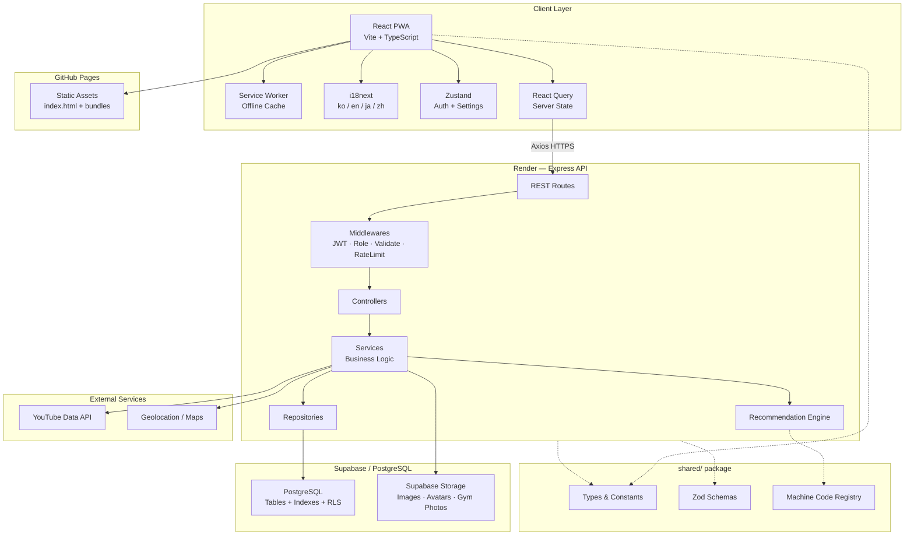
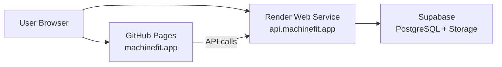
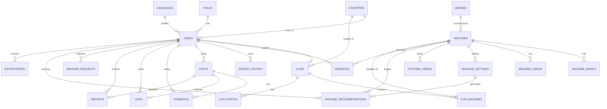
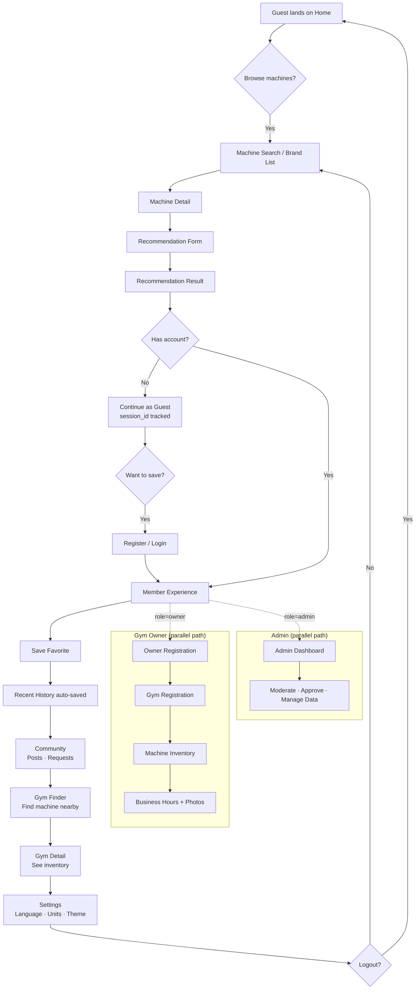
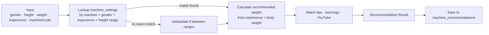

# MachineFit project architecture
_Exported on 7/16/2026 at 19:51:35 GMT+9 from Cursor (3.11.25)_

---

**User**

You are a senior full-stack software architect.

Your mission is to build a production-ready project called "MachineFit".

MachineFit is a global fitness platform that recommends the optimal settings for strength training machines based on user body measurements.

Do NOT immediately generate application code.

First, design the complete project architecture.

====================================================

Technology Stack

Frontend
- React
- Vite
- PWA
- React Router
- React Query
- Zustand
- Axios
- i18next

Backend
- Node.js
- Express
- JWT Authentication
- REST API

Database
- PostgreSQL
- Supabase

Storage
- Supabase Storage

Deployment
- GitHub Pages (Frontend)
- Render (Backend)

IDE
- Cursor AI

====================================================

STEP 1

Generate the complete folder structure.

Include folders for

Frontend

Backend

Database

Shared

Documentation

Configuration

====================================================

Frontend Structure

src/

app/

pages/

components/

layouts/

features/

hooks/

services/

api/

store/

utils/

constants/

styles/

assets/

types/

i18n/

routes/

====================================================

Backend Structure

server/

config/

controllers/

routes/

middlewares/

services/

repositories/

models/

validators/

utils/

uploads/

database/

====================================================

STEP 2

Design the UI architecture.

Include these pages.

Home

Machine Search

Brand List

Machine Detail

Recommendation Result

Gym Finder

Gym Detail

Favorites

Recent History

Community

Machine Request Board

Free Board

Login

Register

My Page

Settings

Gym Owner Dashboard

Admin Dashboard

404

====================================================

STEP 3

Design reusable UI Components.

Examples

Header

Bottom Navigation

Search Bar

Brand Card

Machine Card

Gym Card

Recommendation Card

Youtube Card

Profile Card

Language Selector

Unit Selector

Theme Switch

Loading

Skeleton

Toast

Modal

Dialog

Pagination

====================================================

STEP 4

Design Database Schema.

Tables

Users

Roles

Gyms

GymMachines

Brands

Machines

MachineImages

MachineVideos

MachineSettings

MachineRecommendations

Favorites

RecentHistory

Posts

Comments

Likes

Reports

MachineRequests

Countries

Languages

YoutubeVideos

Notifications

====================================================

Each table must contain

Primary Key

Foreign Keys

Indexes

CreatedAt

UpdatedAt

====================================================

STEP 5

Design REST API.

Authentication

User

Machine

Brand

Gym

Community

Favorite

Recommendation

Admin

Owner

Machine Request

Notifications

Return API list grouped by module.

====================================================

STEP 6

Design application flow.

Guest

↓

Member

↓

Recommendation

↓

Save Favorite

↓

Community

↓

Gym Search

↓

Logout

====================================================

STEP 7

Design global support.

Languages

Korean

English

Japanese

Chinese

Units

cm

ft/in

kg

lb

Timezone

Country

====================================================

STEP 8

Design MachineFit recommendation engine.

Input

Gender

Height

Weight (optional)

Experience

Beginner

Intermediate

Advanced

Professional

Brand

Machine

Output

Seat Position

Back Pad Position

Foot Position

Handle Position

ROM

Recommended Weight

Workout Tips

Warnings

YouTube Videos

====================================================

STEP 9

Design Gym Owner System.

Owner Registration

Gym Registration

Machine Registration

Machine Inventory

Business Hours

Photos

Location

Statistics

====================================================

STEP 10

Design Admin System.

Dashboard

Users

Gyms

Brands

Machines

Posts

Reports

Requests

Statistics

Announcements

====================================================

STEP 11

Future Features

AI Camera Recognition

QR Machine Scan

Workout History

Apple Health

Google Fit

Apple Watch

Galaxy Watch

Wear OS

Health Connect

====================================================

STEP 12

Coding Rules

Use Clean Architecture.

Use Feature Based Structure.

Use reusable components.

Use TypeScript.

Mobile First.

Responsive.

Scalable.

Never duplicate code.

Never hardcode data.

Use Machine Codes instead of machine names.

Support localization from the beginning.

====================================================

STEP 13

DO NOT generate application code yet.

Instead output

1. Folder Structure

2. Architecture Diagram

3. UI Tree

4. Database ERD

5. API List

6. Development Roadmap

Wait for approval before generating code.

---

**Cursor**

Reviewing the existing project setup so the architecture aligns with what's already in place.


# MachineFit — Complete Project Architecture

Production-ready architecture for a global strength-machine fitting platform. No application code yet — review and approve before implementation.

---

## 1. Folder Structure

Monorepo layout with clear separation of concerns.

```
machinefit/
├── .github/
│   └── workflows/
│       ├── frontend-deploy.yml          # GitHub Pages
│       ├── backend-deploy.yml           # Render
│       └── ci.yml                       # Lint, typecheck, test
│
├── .cursor/
│   └── rules/
│       └── machinefit.mdc
│
├── docs/                                # Documentation
│   ├── architecture/
│   │   ├── overview.md
│   │   ├── recommendation-engine.md
│   │   └── deployment.md
│   ├── api/
│   │   └── openapi.yaml
│   ├── database/
│   │   ├── erd.md
│   │   └── migrations-guide.md
│   └── adr/                             # Architecture Decision Records
│       └── 001-monorepo-structure.md
│
├── config/                              # Shared & environment configuration
│   ├── env/
│   │   ├── .env.example
│   │   ├── frontend.env.example
│   │   └── backend.env.example
│   ├── eslint/
│   │   └── shared-eslint.config.js
│   └── tsconfig/
│       └── base.json
│
├── shared/                              # Cross-cutting types & constants
│   ├── types/
│   │   ├── api.types.ts
│   │   ├── machine.types.ts
│   │   ├── user.types.ts
│   │   ├── gym.types.ts
│   │   ├── community.types.ts
│   │   └── recommendation.types.ts
│   ├── constants/
│   │   ├── machine-codes.ts
│   │   ├── roles.ts
│   │   ├── locales.ts
│   │   ├── units.ts
│   │   └── experience-levels.ts
│   ├── validators/
│   │   ├── auth.schema.ts
│   │   ├── machine.schema.ts
│   │   └── recommendation.schema.ts
│   └── utils/
│       ├── unit-converter.ts
│       └── machine-code.ts
│
├── database/                            # Database layer (Supabase / PostgreSQL)
│   ├── migrations/
│   │   ├── 001_extensions.sql
│   │   ├── 002_roles_users.sql
│   │   ├── 003_countries_languages.sql
│   │   ├── 004_brands_machines.sql
│   │   ├── 005_gyms.sql
│   │   ├── 006_recommendations.sql
│   │   ├── 007_favorites_history.sql
│   │   ├── 008_community.sql
│   │   ├── 009_machine_requests.sql
│   │   ├── 010_notifications.sql
│   │   └── 011_indexes_rls.sql
│   ├── seeds/
│   │   ├── roles.sql
│   │   ├── countries.sql
│   │   ├── languages.sql
│   │   ├── brands.sql
│   │   └── machines.sql
│   ├── functions/
│   │   └── recommendation_helpers.sql
│   ├── policies/                        # Supabase RLS policies
│   │   ├── users.sql
│   │   ├── gyms.sql
│   │   └── community.sql
│   └── supabase/
│       ├── config.toml
│       └── storage-buckets.sql
│
├── frontend/                            # React + Vite PWA
│   ├── public/
│   │   ├── manifest.webmanifest
│   │   ├── icons/
│   │   └── robots.txt
│   ├── src/
│   │   ├── app/
│   │   │   ├── App.tsx
│   │   │   ├── providers/
│   │   │   │   ├── AppProviders.tsx
│   │   │   │   ├── QueryProvider.tsx
│   │   │   │   ├── I18nProvider.tsx
│   │   │   │   └── ThemeProvider.tsx
│   │   │   └── bootstrap.ts
│   │   ├── pages/
│   │   │   ├── home/
│   │   │   ├── machine-search/
│   │   │   ├── brand-list/
│   │   │   ├── machine-detail/
│   │   │   ├── recommendation-result/
│   │   │   ├── gym-finder/
│   │   │   ├── gym-detail/
│   │   │   ├── favorites/
│   │   │   ├── recent-history/
│   │   │   ├── community/
│   │   │   ├── machine-request-board/
│   │   │   ├── free-board/
│   │   │   ├── auth/
│   │   │   │   ├── login/
│   │   │   │   └── register/
│   │   │   ├── my-page/
│   │   │   ├── settings/
│   │   │   ├── gym-owner/
│   │   │   │   └── dashboard/
│   │   │   ├── admin/
│   │   │   │   └── dashboard/
│   │   │   └── not-found/
│   │   ├── components/
│   │   │   ├── ui/                      # Primitives (Button, Input, Card…)
│   │   │   ├── layout/
│   │   │   │   ├── Header/
│   │   │   │   ├── BottomNavigation/
│   │   │   │   ├── Sidebar/
│   │   │   │   └── PageContainer/
│   │   │   ├── feedback/
│   │   │   │   ├── Loading/
│   │   │   │   ├── Skeleton/
│   │   │   │   ├── Toast/
│   │   │   │   ├── Modal/
│   │   │   │   └── Dialog/
│   │   │   ├── navigation/
│   │   │   │   ├── SearchBar/
│   │   │   │   ├── Pagination/
│   │   │   │   └── LanguageSelector/
│   │   │   ├── cards/
│   │   │   │   ├── BrandCard/
│   │   │   │   ├── MachineCard/
│   │   │   │   ├── GymCard/
│   │   │   │   ├── RecommendationCard/
│   │   │   │   ├── YoutubeCard/
│   │   │   │   └── ProfileCard/
│   │   │   └── settings/
│   │   │       ├── UnitSelector/
│   │   │       └── ThemeSwitch/
│   │   ├── layouts/
│   │   │   ├── MainLayout.tsx
│   │   │   ├── AuthLayout.tsx
│   │   │   ├── DashboardLayout.tsx
│   │   │   └── AdminLayout.tsx
│   │   ├── features/                    # Feature modules (Clean Architecture)
│   │   │   ├── auth/
│   │   │   │   ├── components/
│   │   │   │   ├── hooks/
│   │   │   │   ├── services/
│   │   │   │   └── store/
│   │   │   ├── machines/
│   │   │   ├── brands/
│   │   │   ├── gyms/
│   │   │   ├── recommendations/
│   │   │   ├── favorites/
│   │   │   ├── history/
│   │   │   ├── community/
│   │   │   ├── machine-requests/
│   │   │   ├── notifications/
│   │   │   ├── gym-owner/
│   │   │   └── admin/
│   │   ├── hooks/
│   │   │   ├── useAuth.ts
│   │   │   ├── useLocale.ts
│   │   │   ├── useUnits.ts
│   │   │   ├── useDebounce.ts
│   │   │   └── useMediaQuery.ts
│   │   ├── services/
│   │   │   ├── http/
│   │   │   │   ├── axios-client.ts
│   │   │   │   └── interceptors.ts
│   │   │   └── storage/
│   │   │       └── local-storage.ts
│   │   ├── api/
│   │   │   ├── auth.api.ts
│   │   │   ├── user.api.ts
│   │   │   ├── machine.api.ts
│   │   │   ├── brand.api.ts
│   │   │   ├── gym.api.ts
│   │   │   ├── recommendation.api.ts
│   │   │   ├── favorite.api.ts
│   │   │   ├── community.api.ts
│   │   │   ├── machine-request.api.ts
│   │   │   ├── notification.api.ts
│   │   │   ├── owner.api.ts
│   │   │   └── admin.api.ts
│   │   ├── store/
│   │   │   ├── auth.store.ts
│   │   │   ├── ui.store.ts
│   │   │   ├── settings.store.ts
│   │   │   └── recommendation.store.ts
│   │   ├── utils/
│   │   │   ├── format.ts
│   │   │   ├── date.ts
│   │   │   └── geo.ts
│   │   ├── constants/
│   │   │   ├── routes.ts
│   │   │   ├── query-keys.ts
│   │   │   └── breakpoints.ts
│   │   ├── styles/
│   │   │   ├── globals.css
│   │   │   ├── variables.css
│   │   │   └── themes/
│   │   │       ├── light.css
│   │   │       └── dark.css
│   │   ├── assets/
│   │   │   ├── images/
│   │   │   └── icons/
│   │   ├── types/
│   │   │   └── index.ts                 # Re-exports from shared/
│   │   ├── i18n/
│   │   │   ├── index.ts
│   │   │   └── locales/
│   │   │       ├── ko/
│   │   │       ├── en/
│   │   │       ├── ja/
│   │   │       └── zh/
│   │   └── routes/
│   │       ├── index.tsx
│   │       ├── public.routes.tsx
│   │       ├── protected.routes.tsx
│   │       ├── owner.routes.tsx
│   │       └── admin.routes.tsx
│   ├── index.html
│   ├── vite.config.ts
│   ├── tsconfig.json
│   └── package.json
│
├── backend/                             # Node.js + Express REST API
│   ├── server/
│   │   ├── index.ts                     # Entry point
│   │   ├── app.ts                       # Express app setup
│   │   ├── config/
│   │   │   ├── env.ts
│   │   │   ├── database.ts
│   │   │   ├── supabase.ts
│   │   │   ├── jwt.ts
│   │   │   └── cors.ts
│   │   ├── controllers/
│   │   │   ├── auth.controller.ts
│   │   │   ├── user.controller.ts
│   │   │   ├── machine.controller.ts
│   │   │   ├── brand.controller.ts
│   │   │   ├── gym.controller.ts
│   │   │   ├── recommendation.controller.ts
│   │   │   ├── favorite.controller.ts
│   │   │   ├── community.controller.ts
│   │   │   ├── machine-request.controller.ts
│   │   │   ├── notification.controller.ts
│   │   │   ├── owner.controller.ts
│   │   │   └── admin.controller.ts
│   │   ├── routes/
│   │   │   ├── index.ts
│   │   │   ├── auth.routes.ts
│   │   │   ├── user.routes.ts
│   │   │   ├── machine.routes.ts
│   │   │   ├── brand.routes.ts
│   │   │   ├── gym.routes.ts
│   │   │   ├── recommendation.routes.ts
│   │   │   ├── favorite.routes.ts
│   │   │   ├── community.routes.ts
│   │   │   ├── machine-request.routes.ts
│   │   │   ├── notification.routes.ts
│   │   │   ├── owner.routes.ts
│   │   │   └── admin.routes.ts
│   │   ├── middlewares/
│   │   │   ├── auth.middleware.ts
│   │   │   ├── role.middleware.ts
│   │   │   ├── validate.middleware.ts
│   │   │   ├── rate-limit.middleware.ts
│   │   │   ├── error.middleware.ts
│   │   │   └── upload.middleware.ts
│   │   ├── services/
│   │   │   ├── auth.service.ts
│   │   │   ├── user.service.ts
│   │   │   ├── machine.service.ts
│   │   │   ├── brand.service.ts
│   │   │   ├── gym.service.ts
│   │   │   ├── recommendation.service.ts
│   │   │   ├── favorite.service.ts
│   │   │   ├── community.service.ts
│   │   │   ├── machine-request.service.ts
│   │   │   ├── notification.service.ts
│   │   │   ├── owner.service.ts
│   │   │   ├── admin.service.ts
│   │   │   ├── storage.service.ts       # Supabase Storage
│   │   │   └── youtube.service.ts
│   │   ├── repositories/
│   │   │   ├── user.repository.ts
│   │   │   ├── machine.repository.ts
│   │   │   ├── brand.repository.ts
│   │   │   ├── gym.repository.ts
│   │   │   ├── recommendation.repository.ts
│   │   │   ├── favorite.repository.ts
│   │   │   ├── community.repository.ts
│   │   │   ├── machine-request.repository.ts
│   │   │   └── notification.repository.ts
│   │   ├── models/                      # DB row mappers / domain entities
│   │   │   ├── user.model.ts
│   │   │   ├── machine.model.ts
│   │   │   ├── gym.model.ts
│   │   │   └── recommendation.model.ts
│   │   ├── validators/
│   │   │   ├── auth.validator.ts
│   │   │   ├── machine.validator.ts
│   │   │   ├── gym.validator.ts
│   │   │   ├── community.validator.ts
│   │   │   └── recommendation.validator.ts
│   │   ├── utils/
│   │   │   ├── jwt.util.ts
│   │   │   ├── hash.util.ts
│   │   │   ├── pagination.util.ts
│   │   │   ├── unit-converter.util.ts
│   │   │   └── machine-code.util.ts
│   │   ├── uploads/                     # Temp upload staging (dev only)
│   │   └── database/
│   │       ├── pool.ts
│   │       └── queries/
│   ├── tsconfig.json
│   ├── package.json
│   └── render.yaml                      # Render deployment blueprint
│
├── package.json                         # Workspace root (npm/pnpm workspaces)
├── pnpm-workspace.yaml
├── .gitignore
└── README.md
```

**Note:** The current repo has a flat Vite starter at root. On approval, migrate to this monorepo layout (`frontend/`, `backend/`, `shared/`, `database/`).

---

## 2. Architecture Diagram



### Clean Architecture Layers

| Layer | Frontend | Backend |
|-------|----------|---------|
| **Presentation** | Pages, Components, Layouts | Controllers, Routes |
| **Application** | Features (hooks, services), React Query | Services, Validators |
| **Domain** | `shared/types`, recommendation logic | Models, Recommendation Engine |
| **Infrastructure** | Axios, i18n, PWA | Repositories, Supabase, Storage |

### Deployment Topology



---

## 3. UI Tree

### Route Map

```
/                           → Home
/machines                   → Machine Search
/brands                     → Brand List
/brands/:brandCode          → Brand Detail (filtered machines)
/machines/:machineCode      → Machine Detail
/recommend/:machineCode     → Recommendation Form
/recommend/:machineCode/result → Recommendation Result
/gyms                       → Gym Finder
/gyms/:gymId                → Gym Detail
/favorites                  → Favorites (auth)
/history                    → Recent History (auth)
/community                  → Community Hub
/community/requests         → Machine Request Board
/community/free             → Free Board
/community/posts/:postId    → Post Detail
/login                      → Login
/register                   → Register
/my-page                    → My Page (auth)
/settings                   → Settings (auth)
/owner                      → Gym Owner Dashboard (owner)
/owner/gyms                 → Owner Gym List
/owner/gyms/:gymId          → Owner Gym Management
/owner/gyms/:gymId/machines → Machine Inventory
/admin                      → Admin Dashboard (admin)
/admin/*                    → Admin sub-pages
/*                          → 404
```

### Page → Layout → Components

```
App
├── AppProviders (Query, i18n, Theme, Toast)
├── Router
│   ├── Public Routes [MainLayout]
│   │   ├── Home
│   │   │   ├── Header
│   │   │   ├── SearchBar
│   │   │   ├── BrandCard (grid)
│   │   │   ├── MachineCard (featured)
│   │   │   ├── RecommendationCard (CTA)
│   │   │   └── BottomNavigation
│   │   │
│   │   ├── Machine Search
│   │   │   ├── SearchBar
│   │   │   ├── FilterBar (brand, muscle, type)
│   │   │   ├── MachineCard (list)
│   │   │   └── Pagination
│   │   │
│   │   ├── Brand List
│   │   │   └── BrandCard (grid)
│   │   │
│   │   ├── Machine Detail
│   │   │   ├── ImageGallery
│   │   │   ├── MachineSpecs
│   │   │   ├── YoutubeCard (carousel)
│   │   │   └── CTA → Recommendation
│   │   │
│   │   ├── Recommendation Form
│   │   │   ├── BodyInputForm (gender, height, weight, experience)
│   │   │   ├── UnitSelector
│   │   │   └── SubmitButton
│   │   │
│   │   ├── Recommendation Result
│   │   │   ├── RecommendationCard (settings)
│   │   │   ├── SettingDiagram (visual)
│   │   │   ├── WorkoutTips
│   │   │   ├── Warnings
│   │   │   ├── YoutubeCard
│   │   │   └── Actions (Favorite, Share, Gym Finder)
│   │   │
│   │   ├── Gym Finder
│   │   │   ├── SearchBar + MapToggle
│   │   │   ├── GymCard (list/map)
│   │   │   └── FilterBar (country, brand, machine)
│   │   │
│   │   ├── Gym Detail
│   │   │   ├── PhotoGallery
│   │   │   ├── BusinessHours
│   │   │   ├── LocationMap
│   │   │   └── MachineCard (inventory)
│   │   │
│   │   ├── Community Hub
│   │   │   ├── TabNav (Requests | Free)
│   │   │   └── PostCard (preview)
│   │   │
│   │   ├── Machine Request Board
│   │   │   ├── PostCard (requests)
│   │   │   └── CreateRequestModal
│   │   │
│   │   └── Free Board
│   │       ├── PostCard
│   │       ├── PostDetail + Comments
│   │       └── CreatePostModal
│   │
│   ├── Auth Routes [AuthLayout]
│   │   ├── Login (email/password, OAuth future)
│   │   └── Register (profile + preferences)
│   │
│   ├── Protected Routes [MainLayout + AuthGuard]
│   │   ├── Favorites
│   │   │   └── MachineCard / RecommendationCard
│   │   ├── Recent History
│   │   │   └── RecommendationCard (timeline)
│   │   ├── My Page
│   │   │   ├── ProfileCard
│   │   │   ├── StatsSummary
│   │   │   └── QuickLinks
│   │   └── Settings
│   │       ├── LanguageSelector
│   │       ├── UnitSelector
│   │       ├── ThemeSwitch
│   │       ├── TimezoneSelector
│   │       └── CountrySelector
│   │
│   ├── Owner Routes [DashboardLayout + OwnerGuard]
│   │   └── Gym Owner Dashboard
│   │       ├── OverviewStats
│   │       ├── GymRegistrationForm
│   │       ├── MachineInventoryTable
│   │       ├── BusinessHoursEditor
│   │       ├── PhotoUploader
│   │       └── LocationPicker
│   │
│   ├── Admin Routes [AdminLayout + AdminGuard]
│   │   └── Admin Dashboard
│   │       ├── Sidebar (Users, Gyms, Brands, Machines, Posts, Reports, Requests, Stats, Announcements)
│   │       ├── DataTable (generic)
│   │       ├── Charts (statistics)
│   │       └── ModerationPanel
│   │
│   └── 404 [MainLayout]
│       └── NotFoundPage
│
└── Global Overlays
    ├── Toast
    ├── Modal / Dialog
    ├── Loading (full-page)
    └── Skeleton (per-section)
```

### Component Library (Reusable)

| Category | Components |
|----------|------------|
| **Layout** | `Header`, `BottomNavigation`, `Sidebar`, `PageContainer`, `AuthLayout`, `DashboardLayout` |
| **Input** | `SearchBar`, `LanguageSelector`, `UnitSelector`, `ThemeSwitch`, `FilterBar`, `BodyInputForm` |
| **Cards** | `BrandCard`, `MachineCard`, `GymCard`, `RecommendationCard`, `YoutubeCard`, `ProfileCard`, `PostCard` |
| **Feedback** | `Loading`, `Skeleton`, `Toast`, `Modal`, `Dialog`, `EmptyState`, `ErrorBoundary` |
| **Navigation** | `Pagination`, `TabNav`, `Breadcrumb` |
| **Display** | `ImageGallery`, `SettingDiagram`, `BusinessHours`, `LocationMap`, `StatsSummary` |

---

## 4. Database ERD

### Entity Relationship Diagram



### Table Definitions

#### `roles`
| Column | Type | Constraints |
|--------|------|-------------|
| id | UUID | PK, DEFAULT gen_random_uuid() |
| code | VARCHAR(20) | UNIQUE NOT NULL — `guest`, `member`, `owner`, `admin` |
| name | JSONB | NOT NULL — i18n labels |
| created_at | TIMESTAMPTZ | NOT NULL DEFAULT now() |
| updated_at | TIMESTAMPTZ | NOT NULL DEFAULT now() |

**Indexes:** `UNIQUE(code)`

---

#### `countries`
| Column | Type | Constraints |
|--------|------|-------------|
| id | UUID | PK |
| code | CHAR(2) | UNIQUE NOT NULL — ISO 3166-1 |
| name | JSONB | NOT NULL — i18n |
| default_timezone | VARCHAR(50) | NOT NULL |
| created_at | TIMESTAMPTZ | NOT NULL |
| updated_at | TIMESTAMPTZ | NOT NULL |

**Indexes:** `UNIQUE(code)`, `GIN(name)`

---

#### `languages`
| Column | Type | Constraints |
|--------|------|-------------|
| id | UUID | PK |
| code | VARCHAR(5) | UNIQUE NOT NULL — `ko`, `en`, `ja`, `zh` |
| name | VARCHAR(50) | NOT NULL |
| native_name | VARCHAR(50) | NOT NULL |
| created_at | TIMESTAMPTZ | NOT NULL |
| updated_at | TIMESTAMPTZ | NOT NULL |

**Indexes:** `UNIQUE(code)`

---

#### `users`
| Column | Type | Constraints |
|--------|------|-------------|
| id | UUID | PK |
| role_id | UUID | FK → roles.id NOT NULL |
| email | VARCHAR(255) | UNIQUE NOT NULL |
| password_hash | VARCHAR(255) | NOT NULL |
| display_name | VARCHAR(100) | NOT NULL |
| gender | VARCHAR(10) | — `male`, `female`, `other` |
| height_cm | DECIMAL(5,2) | nullable |
| weight_kg | DECIMAL(5,2) | nullable |
| experience_level | VARCHAR(20) | — `beginner`…`professional` |
| country_id | UUID | FK → countries.id |
| language_id | UUID | FK → languages.id |
| unit_height | VARCHAR(10) | DEFAULT `cm` — `cm`, `ft_in` |
| unit_weight | VARCHAR(10) | DEFAULT `kg` — `kg`, `lb` |
| timezone | VARCHAR(50) | |
| avatar_url | TEXT | |
| is_active | BOOLEAN | DEFAULT true |
| last_login_at | TIMESTAMPTZ | |
| created_at | TIMESTAMPTZ | NOT NULL |
| updated_at | TIMESTAMPTZ | NOT NULL |

**Indexes:** `UNIQUE(email)`, `idx_users_role_id`, `idx_users_country_id`

---

#### `brands`
| Column | Type | Constraints |
|--------|------|-------------|
| id | UUID | PK |
| code | VARCHAR(50) | UNIQUE NOT NULL — e.g. `HAMMER_STRENGTH` |
| name | JSONB | NOT NULL — i18n |
| logo_url | TEXT | |
| website_url | TEXT | |
| country_id | UUID | FK → countries.id |
| is_active | BOOLEAN | DEFAULT true |
| created_at | TIMESTAMPTZ | NOT NULL |
| updated_at | TIMESTAMPTZ | NOT NULL |

**Indexes:** `UNIQUE(code)`, `GIN(name)`, `idx_brands_country_id`

---

#### `machines`
| Column | Type | Constraints |
|--------|------|-------------|
| id | UUID | PK |
| brand_id | UUID | FK → brands.id NOT NULL |
| code | VARCHAR(80) | UNIQUE NOT NULL — e.g. `HS_ISO_LATERAL_HIGH_ROW` |
| name | JSONB | NOT NULL — i18n |
| muscle_group | VARCHAR(50) | NOT NULL |
| machine_type | VARCHAR(50) | NOT NULL |
| description | JSONB | |
| has_seat | BOOLEAN | DEFAULT true |
| has_back_pad | BOOLEAN | DEFAULT false |
| has_foot_plate | BOOLEAN | DEFAULT false |
| has_handle | BOOLEAN | DEFAULT true |
| rom_type | VARCHAR(30) | — `fixed`, `variable` |
| is_active | BOOLEAN | DEFAULT true |
| created_at | TIMESTAMPTZ | NOT NULL |
| updated_at | TIMESTAMPTZ | NOT NULL |

**Indexes:** `UNIQUE(code)`, `idx_machines_brand_id`, `idx_machines_muscle_group`, `GIN(name)`

---

#### `machine_images`
| Column | Type | Constraints |
|--------|------|-------------|
| id | UUID | PK |
| machine_id | UUID | FK → machines.id ON DELETE CASCADE |
| image_url | TEXT | NOT NULL |
| alt_text | JSONB | |
| sort_order | INT | DEFAULT 0 |
| is_primary | BOOLEAN | DEFAULT false |
| created_at | TIMESTAMPTZ | NOT NULL |
| updated_at | TIMESTAMPTZ | NOT NULL |

**Indexes:** `idx_machine_images_machine_id`, `idx_machine_images_primary`

---

#### `machine_videos`
| Column | Type | Constraints |
|--------|------|-------------|
| id | UUID | PK |
| machine_id | UUID | FK → machines.id ON DELETE CASCADE |
| video_url | TEXT | NOT NULL |
| title | JSONB | |
| sort_order | INT | DEFAULT 0 |
| created_at | TIMESTAMPTZ | NOT NULL |
| updated_at | TIMESTAMPTZ | NOT NULL |

**Indexes:** `idx_machine_videos_machine_id`

---

#### `youtube_videos`
| Column | Type | Constraints |
|--------|------|-------------|
| id | UUID | PK |
| machine_id | UUID | FK → machines.id |
| youtube_id | VARCHAR(20) | NOT NULL |
| title | JSONB | |
| channel_name | VARCHAR(100) | |
| thumbnail_url | TEXT | |
| language_code | VARCHAR(5) | FK ref languages.code |
| sort_order | INT | DEFAULT 0 |
| is_official | BOOLEAN | DEFAULT false |
| created_at | TIMESTAMPTZ | NOT NULL |
| updated_at | TIMESTAMPTZ | NOT NULL |

**Indexes:** `idx_youtube_videos_machine_id`, `idx_youtube_videos_language`

---

#### `machine_settings`
| Column | Type | Constraints |
|--------|------|-------------|
| id | UUID | PK |
| machine_id | UUID | FK → machines.id NOT NULL |
| gender | VARCHAR(10) | NOT NULL |
| experience_level | VARCHAR(20) | NOT NULL |
| height_min_cm | DECIMAL(5,2) | NOT NULL |
| height_max_cm | DECIMAL(5,2) | NOT NULL |
| weight_min_kg | DECIMAL(5,2) | nullable |
| weight_max_kg | DECIMAL(5,2) | nullable |
| seat_position | INT | nullable — notch/step number |
| back_pad_position | INT | nullable |
| foot_position | INT | nullable |
| handle_position | INT | nullable |
| rom_setting | VARCHAR(50) | nullable |
| weight_kg | DECIMAL(5,2) | nullable — recommended load |
| tips | JSONB | — i18n workout tips |
| warnings | JSONB | — i18n safety warnings |
| created_at | TIMESTAMPTZ | NOT NULL |
| updated_at | TIMESTAMPTZ | NOT NULL |

**Indexes:** `idx_machine_settings_lookup (machine_id, gender, experience_level, height_min_cm, height_max_cm)`, `idx_machine_settings_machine_id`

---

#### `machine_recommendations`
| Column | Type | Constraints |
|--------|------|-------------|
| id | UUID | PK |
| user_id | UUID | FK → users.id nullable — guest = null |
| machine_id | UUID | FK → machines.id NOT NULL |
| machine_setting_id | UUID | FK → machine_settings.id nullable |
| gender | VARCHAR(10) | NOT NULL |
| height_cm | DECIMAL(5,2) | NOT NULL |
| weight_kg | DECIMAL(5,2) | nullable |
| experience_level | VARCHAR(20) | NOT NULL |
| seat_position | INT | |
| back_pad_position | INT | |
| foot_position | INT | |
| handle_position | INT | |
| rom_setting | VARCHAR(50) | |
| recommended_weight_kg | DECIMAL(5,2) | |
| tips | JSONB | |
| warnings | JSONB | |
| session_id | VARCHAR(64) | — guest tracking |
| created_at | TIMESTAMPTZ | NOT NULL |
| updated_at | TIMESTAMPTZ | NOT NULL |

**Indexes:** `idx_recommendations_user_id`, `idx_recommendations_machine_id`, `idx_recommendations_session_id`, `idx_recommendations_created_at DESC`

---

#### `gyms`
| Column | Type | Constraints |
|--------|------|-------------|
| id | UUID | PK |
| owner_id | UUID | FK → users.id NOT NULL |
| name | VARCHAR(200) | NOT NULL |
| description | JSONB | |
| address | TEXT | NOT NULL |
| city | VARCHAR(100) | |
| country_id | UUID | FK → countries.id NOT NULL |
| latitude | DECIMAL(10,7) | |
| longitude | DECIMAL(10,7) | |
| phone | VARCHAR(30) | |
| website_url | TEXT | |
| business_hours | JSONB | — per-day schedule |
| is_verified | BOOLEAN | DEFAULT false |
| is_active | BOOLEAN | DEFAULT true |
| created_at | TIMESTAMPTZ | NOT NULL |
| updated_at | TIMESTAMPTZ | NOT NULL |

**Indexes:** `idx_gyms_owner_id`, `idx_gyms_country_id`, `idx_gyms_location (latitude, longitude)`, `idx_gyms_name_trgm` (full-text)

---

#### `gym_photos` (supporting table)
| Column | Type | Constraints |
|--------|------|-------------|
| id | UUID | PK |
| gym_id | UUID | FK → gyms.id ON DELETE CASCADE |
| photo_url | TEXT | NOT NULL |
| sort_order | INT | DEFAULT 0 |
| created_at | TIMESTAMPTZ | NOT NULL |
| updated_at | TIMESTAMPTZ | NOT NULL |

**Indexes:** `idx_gym_photos_gym_id`

---

#### `gym_machines`
| Column | Type | Constraints |
|--------|------|-------------|
| id | UUID | PK |
| gym_id | UUID | FK → gyms.id ON DELETE CASCADE |
| machine_id | UUID | FK → machines.id NOT NULL |
| quantity | INT | DEFAULT 1 |
| notes | TEXT | |
| is_available | BOOLEAN | DEFAULT true |
| created_at | TIMESTAMPTZ | NOT NULL |
| updated_at | TIMESTAMPTZ | NOT NULL |

**Indexes:** `UNIQUE(gym_id, machine_id)`, `idx_gym_machines_machine_id`

---

#### `favorites`
| Column | Type | Constraints |
|--------|------|-------------|
| id | UUID | PK |
| user_id | UUID | FK → users.id ON DELETE CASCADE |
| machine_id | UUID | FK → machines.id |
| recommendation_id | UUID | FK → machine_recommendations.id nullable |
| created_at | TIMESTAMPTZ | NOT NULL |
| updated_at | TIMESTAMPTZ | NOT NULL |

**Indexes:** `UNIQUE(user_id, machine_id)`, `idx_favorites_user_id`

---

#### `recent_history`
| Column | Type | Constraints |
|--------|------|-------------|
| id | UUID | PK |
| user_id | UUID | FK → users.id ON DELETE CASCADE |
| machine_id | UUID | FK → machines.id |
| recommendation_id | UUID | FK → machine_recommendations.id |
| viewed_at | TIMESTAMPTZ | NOT NULL DEFAULT now() |
| created_at | TIMESTAMPTZ | NOT NULL |
| updated_at | TIMESTAMPTZ | NOT NULL |

**Indexes:** `idx_history_user_viewed (user_id, viewed_at DESC)`, `UNIQUE(user_id, recommendation_id)`

---

#### `posts`
| Column | Type | Constraints |
|--------|------|-------------|
| id | UUID | PK |
| user_id | UUID | FK → users.id NOT NULL |
| board_type | VARCHAR(20) | NOT NULL — `free`, `announcement` |
| title | VARCHAR(200) | NOT NULL |
| content | TEXT | NOT NULL |
| language_code | VARCHAR(5) | |
| is_pinned | BOOLEAN | DEFAULT false |
| is_hidden | BOOLEAN | DEFAULT false |
| view_count | INT | DEFAULT 0 |
| created_at | TIMESTAMPTZ | NOT NULL |
| updated_at | TIMESTAMPTZ | NOT NULL |

**Indexes:** `idx_posts_board_type`, `idx_posts_user_id`, `idx_posts_created_at DESC`

---

#### `comments`
| Column | Type | Constraints |
|--------|------|-------------|
| id | UUID | PK |
| post_id | UUID | FK → posts.id ON DELETE CASCADE |
| user_id | UUID | FK → users.id NOT NULL |
| parent_id | UUID | FK → comments.id nullable — nested replies |
| content | TEXT | NOT NULL |
| is_hidden | BOOLEAN | DEFAULT false |
| created_at | TIMESTAMPTZ | NOT NULL |
| updated_at | TIMESTAMPTZ | NOT NULL |

**Indexes:** `idx_comments_post_id`, `idx_comments_user_id`, `idx_comments_parent_id`

---

#### `likes`
| Column | Type | Constraints |
|--------|------|-------------|
| id | UUID | PK |
| user_id | UUID | FK → users.id ON DELETE CASCADE |
| post_id | UUID | FK → posts.id ON DELETE CASCADE |
| created_at | TIMESTAMPTZ | NOT NULL |
| updated_at | TIMESTAMPTZ | NOT NULL |

**Indexes:** `UNIQUE(user_id, post_id)`, `idx_likes_post_id`

---

#### `reports`
| Column | Type | Constraints |
|--------|------|-------------|
| id | UUID | PK |
| reporter_id | UUID | FK → users.id NOT NULL |
| post_id | UUID | FK → posts.id nullable |
| comment_id | UUID | FK → comments.id nullable |
| reason | VARCHAR(50) | NOT NULL |
| description | TEXT | |
| status | VARCHAR(20) | DEFAULT `pending` — `pending`, `resolved`, `dismissed` |
| resolved_by | UUID | FK → users.id nullable |
| created_at | TIMESTAMPTZ | NOT NULL |
| updated_at | TIMESTAMPTZ | NOT NULL |

**Indexes:** `idx_reports_status`, `idx_reports_post_id`

---

#### `machine_requests`
| Column | Type | Constraints |
|--------|------|-------------|
| id | UUID | PK |
| user_id | UUID | FK → users.id NOT NULL |
| brand_name | VARCHAR(100) | |
| machine_name | VARCHAR(200) | NOT NULL |
| description | TEXT | |
| status | VARCHAR(20) | DEFAULT `pending` — `pending`, `approved`, `rejected`, `added` |
| admin_note | TEXT | |
| linked_machine_id | UUID | FK → machines.id nullable |
| created_at | TIMESTAMPTZ | NOT NULL |
| updated_at | TIMESTAMPTZ | NOT NULL |

**Indexes:** `idx_machine_requests_status`, `idx_machine_requests_user_id`

---

#### `notifications`
| Column | Type | Constraints |
|--------|------|-------------|
| id | UUID | PK |
| user_id | UUID | FK → users.id ON DELETE CASCADE |
| type | VARCHAR(50) | NOT NULL — `request_approved`, `report_resolved`, etc. |
| title | JSONB | NOT NULL |
| body | JSONB | |
| payload | JSONB | — deep-link data |
| is_read | BOOLEAN | DEFAULT false |
| created_at | TIMESTAMPTZ | NOT NULL |
| updated_at | TIMESTAMPTZ | NOT NULL |

**Indexes:** `idx_notifications_user_unread (user_id, is_read, created_at DESC)`

---

## 5. REST API List

Base URL: `https://api.machinefit.app/api/v1`

All authenticated endpoints require `Authorization: Bearer <JWT>`.

### Authentication

| Method | Endpoint | Auth | Description |
|--------|----------|------|-------------|
| POST | `/auth/register` | — | Register new member |
| POST | `/auth/login` | — | Login, return JWT + refresh token |
| POST | `/auth/refresh` | Refresh | Refresh access token |
| POST | `/auth/logout` | Member | Invalidate refresh token |
| POST | `/auth/forgot-password` | — | Send reset email |
| POST | `/auth/reset-password` | — | Reset password with token |

### User

| Method | Endpoint | Auth | Description |
|--------|----------|------|-------------|
| GET | `/users/me` | Member | Get current profile |
| PATCH | `/users/me` | Member | Update profile, body stats, preferences |
| PATCH | `/users/me/password` | Member | Change password |
| DELETE | `/users/me` | Member | Deactivate account |
| GET | `/users/me/stats` | Member | Personal usage statistics |

### Machine

| Method | Endpoint | Auth | Description |
|--------|----------|------|-------------|
| GET | `/machines` | — | List machines (filter: brand, muscle, type, q) |
| GET | `/machines/:machineCode` | — | Machine detail by code |
| GET | `/machines/:machineCode/images` | — | Machine images |
| GET | `/machines/:machineCode/videos` | — | Machine videos |
| GET | `/machines/:machineCode/youtube` | — | YouTube recommendations |
| GET | `/machines/search` | — | Full-text search |

### Brand

| Method | Endpoint | Auth | Description |
|--------|----------|------|-------------|
| GET | `/brands` | — | List all brands |
| GET | `/brands/:brandCode` | — | Brand detail |
| GET | `/brands/:brandCode/machines` | — | Machines by brand |

### Gym

| Method | Endpoint | Auth | Description |
|--------|----------|------|-------------|
| GET | `/gyms` | — | List gyms (filter: country, city, machine, brand, lat/lng/radius) |
| GET | `/gyms/:gymId` | — | Gym detail |
| GET | `/gyms/:gymId/machines` | — | Gym machine inventory |
| GET | `/gyms/nearby` | — | Geo-based search |

### Recommendation

| Method | Endpoint | Auth | Description |
|--------|----------|------|-------------|
| POST | `/recommendations` | Optional | Generate recommendation |
| GET | `/recommendations/:id` | Optional | Get recommendation result |
| GET | `/recommendations/machine/:machineCode/preview` | — | Preview settings ranges |

**POST `/recommendations` body:**
```json
{
  "machineCode": "HS_ISO_LATERAL_HIGH_ROW",
  "gender": "male",
  "heightCm": 175,
  "weightKg": 75,
  "experienceLevel": "intermediate",
  "unitHeight": "cm",
  "unitWeight": "kg"
}
```

### Favorite

| Method | Endpoint | Auth | Description |
|--------|----------|------|-------------|
| GET | `/favorites` | Member | List user favorites |
| POST | `/favorites` | Member | Add favorite |
| DELETE | `/favorites/:id` | Member | Remove favorite |
| GET | `/favorites/check/:machineCode` | Member | Check if favorited |

### History

| Method | Endpoint | Auth | Description |
|--------|----------|------|-------------|
| GET | `/history` | Member | Recent recommendation history |
| POST | `/history` | Member | Record history entry |
| DELETE | `/history` | Member | Clear all history |
| DELETE | `/history/:id` | Member | Remove single entry |

### Community

| Method | Endpoint | Auth | Description |
|--------|----------|------|-------------|
| GET | `/community/posts` | — | List posts (filter: board_type) |
| GET | `/community/posts/:postId` | — | Post detail |
| POST | `/community/posts` | Member | Create post |
| PATCH | `/community/posts/:postId` | Member | Edit own post |
| DELETE | `/community/posts/:postId` | Member | Delete own post |
| GET | `/community/posts/:postId/comments` | — | List comments |
| POST | `/community/posts/:postId/comments` | Member | Add comment |
| DELETE | `/community/comments/:commentId` | Member | Delete own comment |
| POST | `/community/posts/:postId/like` | Member | Toggle like |
| POST | `/community/reports` | Member | Report post/comment |

### Machine Request

| Method | Endpoint | Auth | Description |
|--------|----------|------|-------------|
| GET | `/machine-requests` | — | List requests (public board) |
| GET | `/machine-requests/:id` | — | Request detail |
| POST | `/machine-requests` | Member | Submit new machine request |
| PATCH | `/machine-requests/:id` | Member | Edit own pending request |

### Notifications

| Method | Endpoint | Auth | Description |
|--------|----------|------|-------------|
| GET | `/notifications` | Member | List notifications |
| PATCH | `/notifications/:id/read` | Member | Mark as read |
| PATCH | `/notifications/read-all` | Member | Mark all read |
| GET | `/notifications/unread-count` | Member | Unread count |

### Owner (Gym Owner)

| Method | Endpoint | Auth | Description |
|--------|----------|------|-------------|
| POST | `/owner/register` | Member | Apply for gym owner role |
| GET | `/owner/dashboard` | Owner | Owner overview stats |
| GET | `/owner/gyms` | Owner | List owned gyms |
| POST | `/owner/gyms` | Owner | Register new gym |
| PATCH | `/owner/gyms/:gymId` | Owner | Update gym info |
| DELETE | `/owner/gyms/:gymId` | Owner | Deactivate gym |
| POST | `/owner/gyms/:gymId/photos` | Owner | Upload gym photos |
| DELETE | `/owner/gyms/:gymId/photos/:photoId` | Owner | Remove photo |
| GET | `/owner/gyms/:gymId/machines` | Owner | Gym machine inventory |
| POST | `/owner/gyms/:gymId/machines` | Owner | Add machine to gym |
| PATCH | `/owner/gyms/:gymId/machines/:id` | Owner | Update inventory item |
| DELETE | `/owner/gyms/:gymId/machines/:id` | Owner | Remove machine |
| PATCH | `/owner/gyms/:gymId/hours` | Owner | Update business hours |

### Admin

| Method | Endpoint | Auth | Description |
|--------|----------|------|-------------|
| GET | `/admin/dashboard` | Admin | Platform statistics |
| GET | `/admin/users` | Admin | List users |
| PATCH | `/admin/users/:id` | Admin | Update user role/status |
| GET | `/admin/gyms` | Admin | List gyms |
| PATCH | `/admin/gyms/:id/verify` | Admin | Verify gym |
| GET | `/admin/brands` | Admin | List brands |
| POST | `/admin/brands` | Admin | Create brand |
| PATCH | `/admin/brands/:id` | Admin | Update brand |
| GET | `/admin/machines` | Admin | List machines |
| POST | `/admin/machines` | Admin | Create machine |
| PATCH | `/admin/machines/:id` | Admin | Update machine |
| POST | `/admin/machines/:id/settings` | Admin | Add setting rule |
| GET | `/admin/posts` | Admin | Moderate posts |
| PATCH | `/admin/posts/:id` | Admin | Hide/pin post |
| GET | `/admin/reports` | Admin | List reports |
| PATCH | `/admin/reports/:id` | Admin | Resolve report |
| GET | `/admin/machine-requests` | Admin | List requests |
| PATCH | `/admin/machine-requests/:id` | Admin | Approve/reject/link machine |
| POST | `/admin/announcements` | Admin | Create announcement |
| GET | `/admin/statistics` | Admin | Detailed analytics |

### Meta / Config

| Method | Endpoint | Auth | Description |
|--------|----------|------|-------------|
| GET | `/meta/countries` | — | Country list |
| GET | `/meta/languages` | — | Language list |
| GET | `/meta/units` | — | Supported unit options |
| GET | `/health` | — | Health check |

---

## 6. Application Flow



### Guest vs Member Capabilities

| Feature | Guest | Member | Owner | Admin |
|---------|-------|--------|-------|-------|
| Browse machines/brands | ✅ | ✅ | ✅ | ✅ |
| Get recommendations | ✅ | ✅ | ✅ | ✅ |
| Save favorites | ❌ | ✅ | ✅ | ✅ |
| History | ❌ | ✅ | ✅ | ✅ |
| Community post/comment | ❌ | ✅ | ✅ | ✅ |
| Machine request | ❌ | ✅ | ✅ | ✅ |
| Gym owner dashboard | ❌ | ❌ | ✅ | ✅ |
| Admin dashboard | ❌ | ❌ | ❌ | ✅ |

---

## 7. Global Support Design

### Languages (i18next)

| Code | Language | Priority |
|------|----------|----------|
| `ko` | Korean | Default for KR users |
| `en` | English | Fallback default |
| `ja` | Japanese | |
| `zh` | Chinese (Simplified) | |

- All user-facing DB strings stored as **JSONB** (`{ "ko": "...", "en": "...", "ja": "...", "zh": "..." }`).
- Frontend: namespace-per-feature (`machines.json`, `gyms.json`, `common.json`).
- API: `Accept-Language` header; responses return localized fields based on user preference.

### Units

| Type | Options | Storage | Display |
|------|---------|---------|---------|
| Height | `cm`, `ft_in` | Always `cm` in DB | Convert on read |
| Weight | `kg`, `lb` | Always `kg` in DB | Convert on read |

- `shared/utils/unit-converter.ts` — single source of truth.
- Settings persisted in `users.unit_height`, `users.unit_weight` and Zustand `settings.store`.

### Timezone & Country

- `countries.default_timezone` for new users.
- User overrides via `users.timezone`.
- Business hours stored in gym local timezone; converted for display.

---

## 8. Recommendation Engine Design



### Input Schema

```typescript
{
  machineCode: string;      // e.g. "HS_ISO_LATERAL_HIGH_ROW"
  gender: "male" | "female" | "other";
  heightCm: number;
  weightKg?: number;
  experienceLevel: "beginner" | "intermediate" | "advanced" | "professional";
}
```

### Output Schema

```typescript
{
  machineCode: string;
  settings: {
    seatPosition?: number;
    backPadPosition?: number;
    footPosition?: number;
    handlePosition?: number;
    romSetting?: string;
    recommendedWeightKg?: number;
  };
  tips: string[];           // localized
  warnings: string[];       // localized
  youtubeVideos: YoutubeVideo[];
}
```

### Algorithm Rules

1. **Primary match:** `machine_settings` where `height_cm` falls within `[height_min_cm, height_max_cm]` for given `machine_id`, `gender`, `experience_level`.
2. **Weight adjustment:** If `weight_kg` provided, fine-tune `recommended_weight_kg` using experience multipliers:
   - Beginner: 50% of body-weight-based estimate
   - Intermediate: 65%
   - Advanced: 80%
   - Professional: 90%
3. **Interpolation:** If height falls between two ranges, linearly interpolate numeric positions.
4. **Fallback:** Return machine defaults with generic tips if no rules exist.
5. **Machine codes only** — never resolve by display name.

---

## 9. Gym Owner System

| Module | Features |
|--------|----------|
| **Registration** | Member applies → Admin approves → `role` upgraded to `owner` |
| **Gym CRUD** | Name, address, country, phone, website, description (i18n) |
| **Machine Inventory** | Add/remove machines by `machineCode`, quantity, availability notes |
| **Business Hours** | JSONB per-day: `{ "mon": { "open": "06:00", "close": "22:00" }, ... }` |
| **Photos** | Upload to Supabase Storage `gym-photos/{gymId}/` |
| **Location** | Lat/lng + address; shown on Gym Finder map |
| **Statistics** | Views, machine count, verification status |

---

## 10. Admin System

| Module | Capabilities |
|--------|-------------|
| **Dashboard** | Total users, gyms, machines, recommendations, daily active |
| **Users** | Search, change role, deactivate |
| **Gyms** | Verify, deactivate, edit |
| **Brands** | CRUD with i18n names + logos |
| **Machines** | CRUD with codes, images, settings rules |
| **Posts** | Hide, pin, delete |
| **Reports** | Review, resolve, dismiss |
| **Requests** | Approve → create machine, reject with note |
| **Statistics** | Charts: recommendations/day, top machines, top gyms |
| **Announcements** | Pin posts to `board_type: announcement` |

---

## 11. Future Features (Architecture Hooks)

| Feature | Integration Point |
|---------|-----------------|
| **AI Camera Recognition** | New `features/vision/` + `/api/v1/vision/identify` endpoint |
| **QR Machine Scan** | QR encodes `machineCode` → deep link `/machines/:machineCode` |
| **Workout History** | New `workout_sessions` table linked to recommendations |
| **Apple Health / Google Fit** | `features/health-sync/` + OAuth + webhook ingestion |
| **Apple Watch / Galaxy Watch / Wear OS** | Companion API + push notifications |
| **Health Connect** | Android Health Connect SDK bridge |

Reserved folders: `frontend/src/features/vision/`, `frontend/src/features/health-sync/`, `backend/server/services/health-sync.service.ts`.

---

## 12. Coding Rules Summary

| Rule | Implementation |
|------|----------------|
| Clean Architecture | Controller → Service → Repository separation |
| Feature-based structure | `features/machines/`, `features/gyms/`, etc. |
| TypeScript | Strict mode across frontend, backend, shared |
| Mobile first | CSS breakpoints: 320px → 768px → 1024px+ |
| No hardcoded data | Seed files + API-driven content |
| Machine codes | `HS_ISO_LATERAL_HIGH_ROW` not display names |
| i18n from day one | JSONB in DB + i18next namespaces |
| No duplication | `shared/` package imported by both apps |
| PWA | vite-plugin-pwa, offline shell, cache API responses |

---

## 13. Development Roadmap

### Phase 0 — Foundation (Week 1–2)
- [ ] Restructure repo into monorepo (`frontend/`, `backend/`, `shared/`, `database/`)
- [ ] TypeScript strict config, ESLint, shared types package
- [ ] Supabase project setup, initial migrations (roles, users, countries, languages)
- [ ] Express boilerplate with health check, error middleware, JWT auth skeleton
- [ ] Vite + React + PWA + React Router + providers shell
- [ ] i18next setup (ko, en, ja, zh)
- [ ] GitHub Actions CI + deploy pipelines (GitHub Pages + Render)

### Phase 1 — Core Machine Experience (Week 3–5)
- [ ] Database: brands, machines, machine_images, machine_settings, youtube_videos
- [ ] Seed data: top brands + 20 machines with settings rules
- [ ] API: brands, machines, recommendations
- [ ] **Recommendation engine** v1
- [ ] Frontend: Home, Machine Search, Brand List, Machine Detail, Recommendation Form/Result
- [ ] UI components: Header, BottomNav, SearchBar, MachineCard, BrandCard, RecommendationCard, Loading, Skeleton

### Phase 2 — Auth & User (Week 6–7)
- [ ] JWT auth (register, login, refresh, logout)
- [ ] User profile, settings (language, units, theme, timezone)
- [ ] Frontend: Login, Register, My Page, Settings
- [ ] Zustand auth store + Axios interceptors
- [ ] Unit converter utility (cm ↔ ft/in, kg ↔ lb)

### Phase 3 — Favorites & History (Week 8)
- [ ] API: favorites, recent history
- [ ] Auto-save recommendation to history on result view
- [ ] Frontend: Favorites, Recent History pages

### Phase 4 — Gym Finder (Week 9–11)
- [ ] Database: gyms, gym_machines, gym_photos
- [ ] API: gyms, nearby search, gym detail
- [ ] Frontend: Gym Finder (list + map), Gym Detail
- [ ] GymCard, LocationMap, BusinessHours components

### Phase 5 — Community (Week 12–13)
- [ ] Database: posts, comments, likes, reports
- [ ] API: community module
- [ ] Frontend: Community Hub, Free Board, Machine Request Board
- [ ] PostCard, CommentList, CreatePostModal

### Phase 6 — Gym Owner Dashboard (Week 14–15)
- [ ] Owner role application + admin approval flow
- [ ] API: owner module + Supabase Storage uploads
- [ ] Frontend: Owner Dashboard (gym CRUD, inventory, hours, photos)

### Phase 7 — Admin Dashboard (Week 16–17)
- [ ] API: admin module (full CRUD + moderation)
- [ ] Frontend: Admin Dashboard with DataTable, charts, moderation
- [ ] Machine request approval workflow

### Phase 8 — Notifications & Polish (Week 18)
- [ ] Notifications system (in-app)
- [ ] Toast, Modal, Dialog, Pagination polish
- [ ] Performance: React Query caching, image lazy loading
- [ ] PWA offline support for browsed machines
- [ ] E2E smoke tests, accessibility audit

### Phase 9 — Launch (Week 19–20)
- [ ] Production Supabase RLS policies
- [ ] Rate limiting, security hardening
- [ ] SEO meta tags, Open Graph
- [ ] Beta launch: GitHub Pages + Render

### Future Phases (Post-Launch)
- AI Camera Recognition
- QR Machine Scan
- Workout History tracking
- Health platform integrations (Apple Health, Google Fit, watches)
- Push notifications (web push + mobile companions)

---

## Approval Checklist

Before code generation, please confirm or adjust:

1. **Monorepo structure** — migrate current flat Vite root into `frontend/`?
2. **Database** — Supabase-hosted PostgreSQL with RLS, or plain PostgreSQL on Render?
3. **Auth** — custom JWT (as specified) vs Supabase Auth?
4. **Machine code format** — `BRAND_MACHINE_NAME` (e.g. `HS_ISO_LATERAL_HIGH_ROW`)?
5. **Default language** — English fallback, auto-detect browser locale?
6. **Gym owner approval** — admin must approve owner role before dashboard access?
7. **Phase priority** — start with Phase 0 + Phase 1 as planned?

Reply with approval or changes, and implementation will begin.

---

**User**

approval, do it

---

**Cursor**

Implementing Phase 0 foundation: restructuring the monorepo and scaffolding frontend, backend, shared, and database layers.


Creating the monorepo foundation: root config, shared package, and core scaffolding.


Creating database migrations and the backend skeleton.


