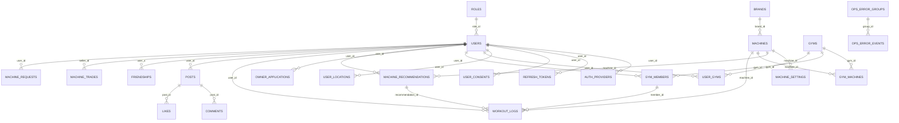
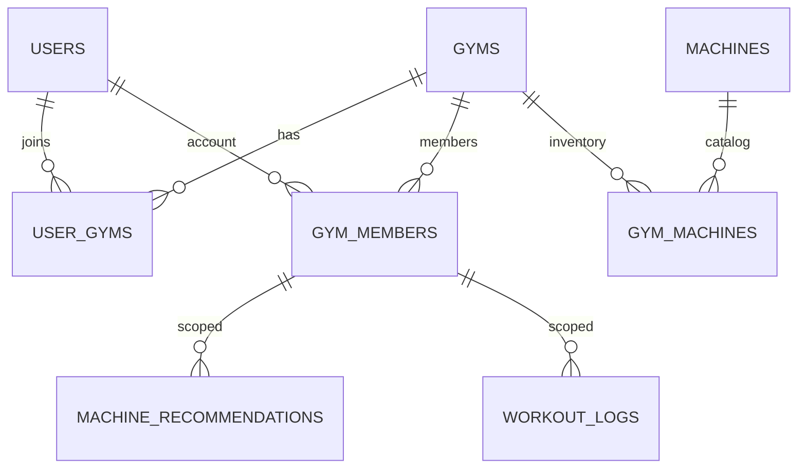
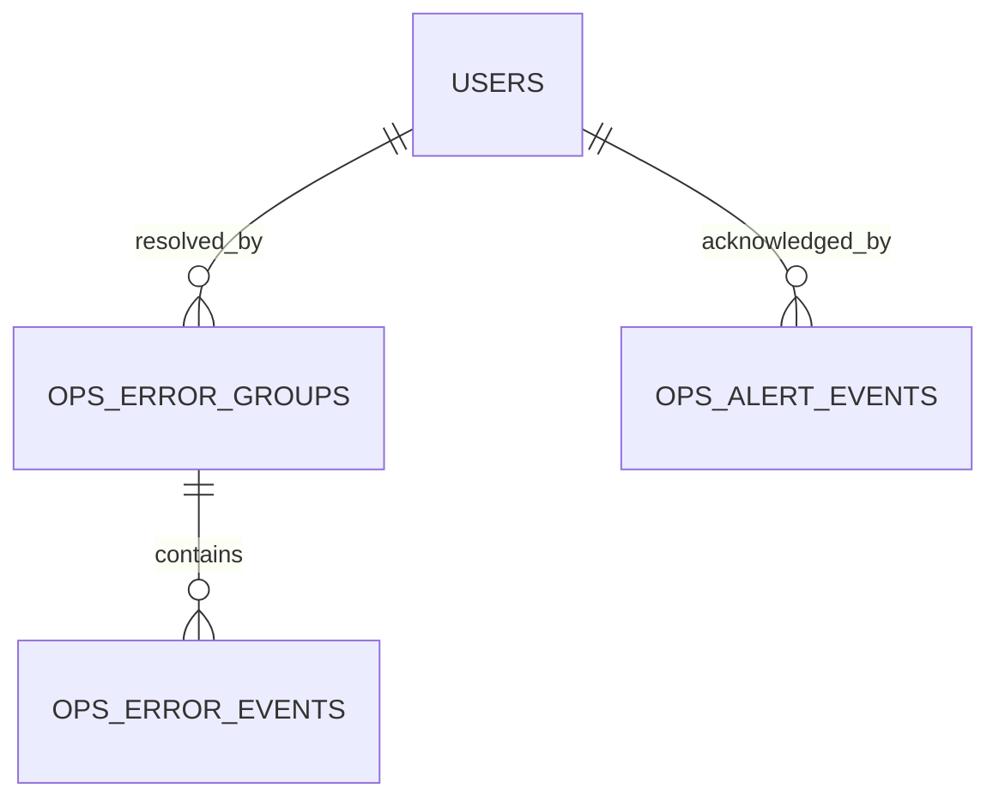

# MachineFit Database — Live Schema

> Snapshot from connected PostgreSQL at **2026-08-04T12:26:53.569Z**  
> Tables: **133** · Foreign keys: **244**

## Domain inventory

| Domain | Tables |
|--------|--------|
| Identity & Auth | 9 |
| Locale & Geo | 9 |
| Machine Catalog | 13 |
| Gym Directory & Owner | 12 |
| Recommendations & Training | 18 |
| Community | 14 |
| Photo Board | 8 |
| Friends | 7 |
| Machine Trades | 4 |
| Online PT | 13 |
| Inspection / Equipment Mgmt | 9 |
| Ops Monitoring | 14 |
| Support | 2 |
| System | 1 |

## Core ERD (hub entities)

## Gym / member scope ERD

## Ops monitoring ERD

---

## Full table specifications

## Identity & Auth

- `roles`
- `users`
- `refresh_tokens`
- `auth_providers`
- `auth_login_events`
- `guest_sessions`
- `user_consents`
- `admin_audit_logs`
- `user_sanctions`

### `roles`

| Column | Type | Null | Default | Keys |
|--------|------|------|---------|------|
| `id` | uuid | NO | gen_random_uuid() | PK |
| `code` | varchar(20) | NO |  |  |
| `name` | jsonb | NO |  |  |
| `created_at` | timestamptz | NO | now() |  |
| `updated_at` | timestamptz | NO | now() |  |

### `users`

| Column | Type | Null | Default | Keys |
|--------|------|------|---------|------|
| `id` | uuid | NO | gen_random_uuid() | PK |
| `role_id` | uuid | NO |  | FK → roles(id) |
| `email` | varchar(255) | NO |  |  |
| `password_hash` | varchar(255) | YES |  |  |
| `display_name` | varchar(100) | NO |  |  |
| `gender` | varchar(10) | YES |  |  |
| `height_cm` | numeric(5,2) | YES |  |  |
| `weight_kg` | numeric(5,2) | YES |  |  |
| `experience_level` | varchar(20) | YES |  |  |
| `country_id` | uuid | YES |  | FK → countries(id) |
| `language_id` | uuid | YES |  | FK → languages(id) |
| `unit_height` | varchar(10) | NO | 'cm'::character varying |  |
| `unit_weight` | varchar(10) | NO | 'kg'::character varying |  |
| `timezone` | varchar(50) | YES |  |  |
| `avatar_url` | text | YES |  |  |
| `is_active` | boolean | NO | true |  |
| `last_login_at` | timestamptz | YES |  |  |
| `created_at` | timestamptz | NO | now() |  |
| `updated_at` | timestamptz | NO | now() |  |
| `age` | smallint | YES |  |  |
| `workout_goal` | varchar(30) | YES |  |  |
| `home_gym_id` | uuid | YES |  | FK → gyms(id) |
| `home_gym_name` | varchar(120) | YES |  |  |
| `active_gym_id` | uuid | YES |  | FK → user_gyms(id) |
| `subscription_plan` | varchar(20) | NO | 'free'::character varying |  |
| `marketing_opt_in` | boolean | NO | false |  |
| `deactivated_at` | timestamptz | YES |  |  |
| `location_opt_in` | boolean | NO | false |  |
| `push_service_opt_in` | boolean | NO | true |  |
| `terms_version` | varchar(32) | YES |  |  |
| `privacy_version` | varchar(32) | YES |  |  |
| `location_version` | varchar(32) | YES |  |  |
| `marketing_version` | varchar(32) | YES |  |  |
| `terms_agreed_at` | timestamptz | YES |  |  |
| `privacy_agreed_at` | timestamptz | YES |  |  |
| `location_agreed_at` | timestamptz | YES |  |  |
| `marketing_agreed_at` | timestamptz | YES |  |  |

### `refresh_tokens`

| Column | Type | Null | Default | Keys |
|--------|------|------|---------|------|
| `id` | uuid | NO | gen_random_uuid() | PK |
| `user_id` | uuid | NO |  | FK → users(id) |
| `token_hash` | varchar(255) | NO |  |  |
| `expires_at` | timestamptz | NO |  |  |
| `created_at` | timestamptz | NO | now() |  |
| `updated_at` | timestamptz | NO | now() |  |

### `auth_providers`

| Column | Type | Null | Default | Keys |
|--------|------|------|---------|------|
| `id` | uuid | NO | gen_random_uuid() | PK |
| `user_id` | uuid | NO |  | FK → users(id) |
| `provider` | varchar(20) | NO |  |  |
| `provider_user_id` | varchar(255) | NO |  |  |
| `provider_email` | varchar(255) | YES |  |  |
| `created_at` | timestamptz | NO | now() |  |
| `updated_at` | timestamptz | NO | now() |  |

### `auth_login_events`

| Column | Type | Null | Default | Keys |
|--------|------|------|---------|------|
| `id` | uuid | NO | gen_random_uuid() | PK |
| `user_id` | uuid | YES |  | FK → users(id) |
| `email` | varchar(255) | YES |  |  |
| `success` | boolean | NO |  |  |
| `failure_reason` | varchar(80) | YES |  |  |
| `ip_address` | varchar(64) | YES |  |  |
| `user_agent` | text | YES |  |  |
| `created_at` | timestamptz | NO | now() |  |

### `guest_sessions`

| Column | Type | Null | Default | Keys |
|--------|------|------|---------|------|
| `id` | uuid | NO | gen_random_uuid() | PK |
| `session_id` | varchar(64) | NO |  |  |
| `language_code` | varchar(5) | YES | 'en'::character varying |  |
| `country_code` | character | YES |  |  |
| `unit_height` | varchar(10) | YES | 'cm'::character varying |  |
| `unit_weight` | varchar(10) | YES | 'kg'::character varying |  |
| `last_seen_at` | timestamptz | NO | now() |  |
| `metadata` | jsonb | YES |  |  |
| `created_at` | timestamptz | NO | now() |  |
| `updated_at` | timestamptz | NO | now() |  |

### `user_consents`

| Column | Type | Null | Default | Keys |
|--------|------|------|---------|------|
| `id` | uuid | NO | gen_random_uuid() | PK |
| `user_id` | uuid | NO |  | FK → users(id) |
| `consent_type` | varchar(40) | NO |  |  |
| `version` | varchar(32) | NO |  |  |
| `agreed` | boolean | NO | true |  |
| `agreed_at` | timestamptz | NO | now() |  |
| `region_code` | varchar(16) | NO | 'KR'::character varying |  |
| `ip_address` | varchar(64) | YES |  |  |
| `user_agent` | text | YES |  |  |
| `source` | varchar(40) | NO | 'app'::character varying |  |

### `admin_audit_logs`

| Column | Type | Null | Default | Keys |
|--------|------|------|---------|------|
| `id` | uuid | NO | gen_random_uuid() | PK |
| `actor_id` | uuid | YES |  | FK → users(id) |
| `actor_role` | varchar(40) | YES |  |  |
| `action` | varchar(80) | NO |  |  |
| `target_type` | varchar(40) | YES |  |  |
| `target_id` | varchar(80) | YES |  |  |
| `meta` | jsonb | NO | '{}'::jsonb |  |
| `ip_address` | varchar(64) | YES |  |  |
| `user_agent` | text | YES |  |  |
| `created_at` | timestamptz | NO | now() |  |

### `user_sanctions`

| Column | Type | Null | Default | Keys |
|--------|------|------|---------|------|
| `id` | uuid | NO | gen_random_uuid() | PK |
| `user_id` | uuid | NO |  | FK → users(id) |
| `sanction_type` | varchar(40) | NO |  |  |
| `reason` | text | YES |  |  |
| `created_by` | uuid | YES |  | FK → users(id) |
| `starts_at` | timestamptz | NO | now() |  |
| `ends_at` | timestamptz | YES |  |  |
| `is_active` | boolean | NO | true |  |
| `created_at` | timestamptz | NO | now() |  |

## Locale & Geo

- `countries`
- `languages`
- `translations`
- `board_types`
- `location_states`
- `location_cities`
- `location_districts`
- `user_locations`
- `legal_documents`

### `countries`

| Column | Type | Null | Default | Keys |
|--------|------|------|---------|------|
| `id` | uuid | NO | gen_random_uuid() | PK |
| `code` | character | NO |  |  |
| `name` | jsonb | NO |  |  |
| `default_timezone` | varchar(50) | NO |  |  |
| `created_at` | timestamptz | NO | now() |  |
| `updated_at` | timestamptz | NO | now() |  |
| `flag_emoji` | varchar(8) | YES |  |  |
| `is_active` | boolean | NO | true |  |
| `sort_order` | integer | NO | 1000 |  |

### `languages`

| Column | Type | Null | Default | Keys |
|--------|------|------|---------|------|
| `id` | uuid | NO | gen_random_uuid() | PK |
| `code` | varchar(5) | NO |  |  |
| `name` | varchar(50) | NO |  |  |
| `native_name` | varchar(50) | NO |  |  |
| `created_at` | timestamptz | NO | now() |  |
| `updated_at` | timestamptz | NO | now() |  |

### `translations`

| Column | Type | Null | Default | Keys |
|--------|------|------|---------|------|
| `id` | uuid | NO | gen_random_uuid() | PK |
| `key` | varchar(120) | NO |  |  |
| `namespace` | varchar(50) | NO | 'common'::character varying |  |
| `values` | jsonb | NO |  |  |
| `description` | text | YES |  |  |
| `created_at` | timestamptz | NO | now() |  |
| `updated_at` | timestamptz | NO | now() |  |

### `board_types`

| Column | Type | Null | Default | Keys |
|--------|------|------|---------|------|
| `id` | uuid | NO | gen_random_uuid() | PK |
| `code` | varchar(30) | NO |  |  |
| `name` | jsonb | NO |  |  |
| `description` | jsonb | YES |  |  |
| `sort_order` | integer | NO | 0 |  |
| `is_active` | boolean | NO | true |  |
| `created_at` | timestamptz | NO | now() |  |
| `updated_at` | timestamptz | NO | now() |  |

### `location_states`

| Column | Type | Null | Default | Keys |
|--------|------|------|---------|------|
| `id` | uuid | NO | gen_random_uuid() | PK |
| `country_code` | character | NO |  | FK → countries(code) |
| `code` | varchar(40) | NO |  |  |
| `name` | jsonb | NO |  |  |
| `latitude` | numeric(10,7) | YES |  |  |
| `longitude` | numeric(10,7) | YES |  |  |
| `is_active` | boolean | NO | true |  |
| `sort_order` | integer | NO | 1000 |  |
| `created_at` | timestamptz | NO | now() |  |
| `updated_at` | timestamptz | NO | now() |  |

### `location_cities`

| Column | Type | Null | Default | Keys |
|--------|------|------|---------|------|
| `id` | uuid | NO | gen_random_uuid() | PK |
| `state_id` | uuid | NO |  | FK → location_states(id) |
| `code` | varchar(40) | NO |  |  |
| `name` | jsonb | NO |  |  |
| `latitude` | numeric(10,7) | YES |  |  |
| `longitude` | numeric(10,7) | YES |  |  |
| `is_active` | boolean | NO | true |  |
| `sort_order` | integer | NO | 1000 |  |
| `created_at` | timestamptz | NO | now() |  |
| `updated_at` | timestamptz | NO | now() |  |

### `location_districts`

| Column | Type | Null | Default | Keys |
|--------|------|------|---------|------|
| `id` | uuid | NO | gen_random_uuid() | PK |
| `city_id` | uuid | NO |  | FK → location_cities(id) |
| `code` | varchar(40) | NO |  |  |
| `name` | jsonb | NO |  |  |
| `latitude` | numeric(10,7) | YES |  |  |
| `longitude` | numeric(10,7) | YES |  |  |
| `is_active` | boolean | NO | true |  |
| `sort_order` | integer | NO | 1000 |  |
| `created_at` | timestamptz | NO | now() |  |
| `updated_at` | timestamptz | NO | now() |  |

### `user_locations`

| Column | Type | Null | Default | Keys |
|--------|------|------|---------|------|
| `user_id` | uuid | NO |  | PK FK → users(id) |
| `country_code` | character | YES |  | FK → countries(code) |
| `state_id` | uuid | YES |  | FK → location_states(id) |
| `city_id` | uuid | YES |  | FK → location_cities(id) |
| `district_id` | uuid | YES |  | FK → location_districts(id) |
| `postal_code` | varchar(32) | YES |  |  |
| `latitude` | numeric(10,7) | YES |  |  |
| `longitude` | numeric(10,7) | YES |  |  |
| `visibility` | varchar(20) | NO | 'city'::character varying |  |
| `updated_at` | timestamptz | NO | now() |  |
| `district_name` | varchar(120) | YES |  |  |

### `legal_documents`

| Column | Type | Null | Default | Keys |
|--------|------|------|---------|------|
| `id` | uuid | NO | gen_random_uuid() | PK |
| `region_code` | varchar(16) | NO | 'KR'::character varying |  |
| `doc_type` | varchar(40) | NO |  |  |
| `version` | varchar(32) | NO |  |  |
| `title` | varchar(200) | NO |  |  |
| `summary` | text | YES |  |  |
| `body_md` | text | YES |  |  |
| `effective_at` | timestamptz | NO | now() |  |
| `is_active` | boolean | NO | true |  |
| `created_by` | uuid | YES |  | FK → users(id) |
| `created_at` | timestamptz | NO | now() |  |
| `updated_at` | timestamptz | NO | now() |  |

## Machine Catalog

- `brands`
- `brand_assets`
- `machines`
- `machine_aliases`
- `machine_images`
- `machine_videos`
- `youtube_videos`
- `machine_settings`
- `machine_qr_codes`
- `machine_embeddings`
- `machine_cover_images`
- `muscle_group_images`
- `ai_models`

### `brands`

| Column | Type | Null | Default | Keys |
|--------|------|------|---------|------|
| `id` | uuid | NO | gen_random_uuid() | PK |
| `code` | varchar(50) | NO |  |  |
| `name` | jsonb | NO |  |  |
| `logo_url` | text | YES |  |  |
| `website_url` | text | YES |  |  |
| `country_id` | uuid | YES |  | FK → countries(id) |
| `is_active` | boolean | NO | true |  |
| `created_at` | timestamptz | NO | now() |  |
| `updated_at` | timestamptz | NO | now() |  |
| `description` | jsonb | YES |  |  |
| `sort_order` | integer | NO | 0 |  |
| `image_url` | text | YES |  |  |

### `brand_assets`

| Column | Type | Null | Default | Keys |
|--------|------|------|---------|------|
| `brand_id` | uuid | NO |  | PK FK → brands(id) |
| `brand_code` | varchar(80) | NO |  |  |
| `logo_url` | text | YES |  |  |
| `logo_mime_type` | text | YES |  |  |
| `logo_version` | integer | NO | 0 |  |
| `logo_data` | bytea | YES |  |  |
| `image_url` | text | YES |  |  |
| `image_mime_type` | text | YES |  |  |
| `image_version` | integer | NO | 0 |  |
| `image_data` | bytea | YES |  |  |
| `created_at` | timestamptz | NO | now() |  |
| `updated_at` | timestamptz | NO | now() |  |

### `machines`

| Column | Type | Null | Default | Keys |
|--------|------|------|---------|------|
| `id` | uuid | NO | gen_random_uuid() | PK |
| `brand_id` | uuid | NO |  | FK → brands(id) |
| `code` | varchar(80) | NO |  |  |
| `name` | jsonb | NO |  |  |
| `muscle_group` | varchar(50) | NO |  |  |
| `machine_type` | varchar(50) | NO |  |  |
| `description` | jsonb | YES |  |  |
| `has_seat` | boolean | NO | true |  |
| `has_back_pad` | boolean | NO | false |  |
| `has_foot_plate` | boolean | NO | false |  |
| `has_handle` | boolean | NO | true |  |
| `rom_type` | varchar(30) | YES |  |  |
| `is_active` | boolean | NO | true |  |
| `created_at` | timestamptz | NO | now() |  |
| `updated_at` | timestamptz | NO | now() |  |
| `how_to` | jsonb | YES |  |  |
| `warnings` | jsonb | YES |  |  |
| `tips` | jsonb | YES |  |  |
| `beginner_tips` | jsonb | YES |  |  |
| `recommended_experience` | varchar(20) | YES |  |  |
| `intermediate_tips` | jsonb | YES |  |  |
| `advanced_tips` | jsonb | YES |  |  |
| `pro_tips` | jsonb | YES |  |  |
| `sort_order` | integer | NO | 0 |  |

### `machine_aliases`

| Column | Type | Null | Default | Keys |
|--------|------|------|---------|------|
| `id` | uuid | NO | gen_random_uuid() | PK |
| `machine_id` | uuid | NO |  | FK → machines(id) |
| `alias` | varchar(200) | NO |  |  |
| `alias_type` | varchar(30) | NO | 'search'::character varying |  |
| `language_code` | varchar(5) | YES |  |  |
| `source` | varchar(50) | YES |  |  |
| `is_active` | boolean | NO | true |  |
| `created_at` | timestamptz | NO | now() |  |
| `updated_at` | timestamptz | NO | now() |  |

### `machine_images`

| Column | Type | Null | Default | Keys |
|--------|------|------|---------|------|
| `id` | uuid | NO | gen_random_uuid() | PK |
| `machine_id` | uuid | NO |  | FK → machines(id) |
| `image_url` | text | NO |  |  |
| `alt_text` | jsonb | YES |  |  |
| `sort_order` | integer | NO | 0 |  |
| `is_primary` | boolean | NO | false |  |
| `created_at` | timestamptz | NO | now() |  |
| `updated_at` | timestamptz | NO | now() |  |

### `machine_videos`

| Column | Type | Null | Default | Keys |
|--------|------|------|---------|------|
| `id` | uuid | NO | gen_random_uuid() | PK |
| `machine_id` | uuid | NO |  | FK → machines(id) |
| `video_url` | text | NO |  |  |
| `title` | jsonb | YES |  |  |
| `sort_order` | integer | NO | 0 |  |
| `created_at` | timestamptz | NO | now() |  |
| `updated_at` | timestamptz | NO | now() |  |

### `youtube_videos`

| Column | Type | Null | Default | Keys |
|--------|------|------|---------|------|
| `id` | uuid | NO | gen_random_uuid() | PK |
| `machine_id` | uuid | NO |  | FK → machines(id) |
| `youtube_id` | varchar(20) | NO |  |  |
| `title` | jsonb | YES |  |  |
| `channel_name` | varchar(100) | YES |  |  |
| `thumbnail_url` | text | YES |  |  |
| `language_code` | varchar(5) | YES |  |  |
| `sort_order` | integer | NO | 0 |  |
| `is_official` | boolean | NO | false |  |
| `created_at` | timestamptz | NO | now() |  |
| `updated_at` | timestamptz | NO | now() |  |

### `machine_settings`

| Column | Type | Null | Default | Keys |
|--------|------|------|---------|------|
| `id` | uuid | NO | gen_random_uuid() | PK |
| `machine_id` | uuid | NO |  | FK → machines(id) |
| `gender` | varchar(10) | NO |  |  |
| `experience_level` | varchar(20) | NO |  |  |
| `height_min_cm` | numeric(5,2) | NO |  |  |
| `height_max_cm` | numeric(5,2) | NO |  |  |
| `weight_min_kg` | numeric(5,2) | YES |  |  |
| `weight_max_kg` | numeric(5,2) | YES |  |  |
| `seat_position` | integer | YES |  |  |
| `back_pad_position` | integer | YES |  |  |
| `foot_position` | integer | YES |  |  |
| `handle_position` | integer | YES |  |  |
| `rom_setting` | varchar(50) | YES |  |  |
| `weight_kg` | numeric(5,2) | YES |  |  |
| `tips` | jsonb | YES |  |  |
| `warnings` | jsonb | YES |  |  |
| `created_at` | timestamptz | NO | now() |  |
| `updated_at` | timestamptz | NO | now() |  |

### `machine_qr_codes`

| Column | Type | Null | Default | Keys |
|--------|------|------|---------|------|
| `id` | uuid | NO | gen_random_uuid() | PK |
| `machine_id` | uuid | NO |  | FK → machines(id) |
| `qr_code` | varchar(100) | NO |  |  |
| `deep_link_path` | varchar(255) | NO |  |  |
| `label` | jsonb | YES |  |  |
| `is_active` | boolean | NO | true |  |
| `created_at` | timestamptz | NO | now() |  |
| `updated_at` | timestamptz | NO | now() |  |

### `machine_embeddings`

| Column | Type | Null | Default | Keys |
|--------|------|------|---------|------|
| `id` | uuid | NO | gen_random_uuid() | PK |
| `machine_id` | uuid | NO |  | FK → machines(id) |
| `ai_model_id` | uuid | NO |  | FK → ai_models(id) |
| `embedding` | jsonb | NO |  |  |
| `dimensions` | integer | NO | 1536 |  |
| `source_image_url` | text | YES |  |  |
| `created_at` | timestamptz | NO | now() |  |
| `updated_at` | timestamptz | NO | now() |  |

### `machine_cover_images`

| Column | Type | Null | Default | Keys |
|--------|------|------|---------|------|
| `machine_id` | uuid | NO |  | FK → machines(id) |
| `machine_code` | varchar(80) | NO |  |  |
| `image_url` | text | NO |  |  |
| `thumbnail_url` | text | YES |  |  |
| `storage_path` | text | YES |  |  |
| `thumbnail_storage_path` | text | YES |  |  |
| `original_filename` | text | YES |  |  |
| `mime_type` | text | YES |  |  |
| `file_size_bytes` | integer | YES |  |  |
| `width` | integer | YES |  |  |
| `height` | integer | YES |  |  |
| `version` | integer | NO | 1 |  |
| `image_data` | bytea | YES |  |  |
| `thumbnail_data` | bytea | YES |  |  |
| `created_at` | timestamptz | NO | now() |  |
| `updated_at` | timestamptz | NO | now() |  |
| `id` | uuid | NO | gen_random_uuid() | PK |
| `target_muscle_group` | varchar(40) | YES |  |  |

### `muscle_group_images`

| Column | Type | Null | Default | Keys |
|--------|------|------|---------|------|
| `muscle_group` | text | NO |  | PK |
| `image_url` | text | NO |  |  |
| `thumbnail_url` | text | YES |  |  |
| `storage_path` | text | YES |  |  |
| `thumbnail_storage_path` | text | YES |  |  |
| `original_filename` | text | YES |  |  |
| `mime_type` | text | YES |  |  |
| `file_size_bytes` | integer | YES |  |  |
| `width` | integer | YES |  |  |
| `height` | integer | YES |  |  |
| `version` | integer | NO | 1 |  |
| `created_at` | timestamptz | NO | now() |  |
| `updated_at` | timestamptz | NO | now() |  |
| `image_data` | bytea | YES |  |  |
| `thumbnail_data` | bytea | YES |  |  |

### `ai_models`

| Column | Type | Null | Default | Keys |
|--------|------|------|---------|------|
| `id` | uuid | NO | gen_random_uuid() | PK |
| `code` | varchar(50) | NO |  |  |
| `name` | varchar(100) | NO |  |  |
| `model_type` | varchar(30) | NO |  |  |
| `version` | varchar(30) | NO |  |  |
| `provider` | varchar(50) | YES |  |  |
| `config` | jsonb | YES |  |  |
| `is_active` | boolean | NO | true |  |
| `created_at` | timestamptz | NO | now() |  |
| `updated_at` | timestamptz | NO | now() |  |

## Gym Directory & Owner

- `gyms`
- `gym_photos`
- `gym_machines`
- `gym_machine_photos`
- `gym_machine_qr_codes`
- `gym_owner_permissions`
- `gym_directory`
- `owner_applications`
- `trainer_applications`
- `user_gyms`
- `gym_members`
- `gym_member_profile_requests`

### `gyms`

| Column | Type | Null | Default | Keys |
|--------|------|------|---------|------|
| `id` | uuid | NO | gen_random_uuid() | PK |
| `owner_id` | uuid | NO |  | FK → users(id) |
| `name` | varchar(200) | NO |  |  |
| `description` | jsonb | YES |  |  |
| `address` | text | NO |  |  |
| `city` | varchar(100) | YES |  |  |
| `country_id` | uuid | NO |  | FK → countries(id) |
| `latitude` | numeric(10,7) | YES |  |  |
| `longitude` | numeric(10,7) | YES |  |  |
| `phone` | varchar(30) | YES |  |  |
| `website_url` | text | YES |  |  |
| `business_hours` | jsonb | YES |  |  |
| `is_verified` | boolean | NO | false |  |
| `is_active` | boolean | NO | true |  |
| `created_at` | timestamptz | NO | now() |  |
| `updated_at` | timestamptz | NO | now() |  |
| `slug` | varchar(100) | YES |  |  |
| `registration_status` | varchar(20) | NO | 'approved'::character varying |  |
| `submitted_at` | timestamptz | YES |  |  |
| `approved_by` | uuid | YES |  | FK → users(id) |
| `approved_at` | timestamptz | YES |  |  |
| `rejection_reason` | text | YES |  |  |
| `amenities` | jsonb | YES |  |  |
| `search_vector` | tsvector | YES |  |  |
| `state_id` | uuid | YES |  | FK → location_states(id) |
| `city_id` | uuid | YES |  | FK → location_cities(id) |
| `district_id` | uuid | YES |  | FK → location_districts(id) |
| `postal_code` | varchar(32) | YES |  |  |
| `district_name` | varchar(120) | YES |  |  |

### `gym_photos`

| Column | Type | Null | Default | Keys |
|--------|------|------|---------|------|
| `id` | uuid | NO | gen_random_uuid() | PK |
| `gym_id` | uuid | NO |  | FK → gyms(id) |
| `photo_url` | text | NO |  |  |
| `sort_order` | integer | NO | 0 |  |
| `created_at` | timestamptz | NO | now() |  |
| `updated_at` | timestamptz | NO | now() |  |

### `gym_machines`

| Column | Type | Null | Default | Keys |
|--------|------|------|---------|------|
| `id` | uuid | NO | gen_random_uuid() | PK |
| `gym_id` | uuid | NO |  | FK → gyms(id) |
| `machine_id` | uuid | NO |  | FK → machines(id) |
| `quantity` | integer | NO | 1 |  |
| `notes` | text | YES |  |  |
| `is_available` | boolean | NO | true |  |
| `created_at` | timestamptz | NO | now() |  |
| `updated_at` | timestamptz | NO | now() |  |
| `instance_label` | varchar(100) | YES |  |  |
| `floor_zone` | varchar(50) | YES |  |  |
| `condition_notes` | text | YES |  |  |
| `last_verified_at` | timestamptz | YES |  |  |
| `registered_by` | uuid | YES |  | FK → users(id) |
| `registered_by_role` | varchar(20) | NO | 'member'::character varying |  |
| `is_verified` | boolean | NO | false |  |
| `status` | varchar(20) | NO | 'active'::character varying |  |
| `deleted_at` | timestamptz | YES |  |  |
| `deleted_by` | uuid | YES |  | FK → users(id) |
| `brand_id` | uuid | YES |  | FK → brands(id) |
| `machine_code` | varchar(80) | YES |  |  |
| `serial_number` | varchar(120) | YES |  |  |
| `qr_code` | varchar(120) | YES |  |  |
| `nickname` | varchar(120) | YES |  |  |
| `location` | varchar(120) | YES |  |  |
| `purchase_date` | date | YES |  |  |
| `purchase_price` | numeric(12,2) | YES |  |  |
| `warranty_end_date` | date | YES |  |  |
| `install_date` | date | YES |  |  |
| `ops_status` | varchar(30) | NO | 'ACTIVE'::character varying |  |
| `health_score` | integer | NO | 100 |  |
| `inspection_cycle` | varchar(30) | NO | 'MONTHLY'::character varying |  |
| `usage_limit_count` | integer | YES |  |  |
| `usage_limit_volume` | numeric(14,2) | YES |  |  |
| `manager_user_id` | uuid | YES |  | FK → users(id) |
| `memo` | text | YES |  |  |
| `last_inspection_at` | timestamptz | YES |  |  |
| `next_inspection_at` | timestamptz | YES |  |  |

### `gym_machine_photos`

| Column | Type | Null | Default | Keys |
|--------|------|------|---------|------|
| `id` | uuid | NO | gen_random_uuid() | PK |
| `gym_machine_id` | uuid | NO |  | FK → gym_machines(id) |
| `image_type` | varchar(30) | NO | 'CURRENT'::character varying |  |
| `image_url` | text | NO |  |  |
| `uploaded_by` | uuid | YES |  | FK → users(id) |
| `deleted_at` | timestamptz | YES |  |  |
| `created_at` | timestamptz | NO | now() |  |

### `gym_machine_qr_codes`

| Column | Type | Null | Default | Keys |
|--------|------|------|---------|------|
| `id` | uuid | NO | gen_random_uuid() | PK |
| `gym_machine_id` | uuid | NO |  | FK → gym_machines(id) |
| `qr_code` | varchar(100) | NO |  |  |
| `deep_link_path` | varchar(255) | NO |  |  |
| `is_active` | boolean | NO | true |  |
| `created_at` | timestamptz | NO | now() |  |
| `updated_at` | timestamptz | NO | now() |  |

### `gym_owner_permissions`

| Column | Type | Null | Default | Keys |
|--------|------|------|---------|------|
| `id` | uuid | NO | gen_random_uuid() | PK |
| `gym_id` | uuid | NO |  | FK → gyms(id) |
| `user_id` | uuid | NO |  | FK → users(id) |
| `permission_role` | varchar(30) | NO | 'operator'::character varying |  |
| `status` | varchar(20) | NO | 'active'::character varying |  |
| `granted_by` | uuid | YES |  | FK → users(id) |
| `created_at` | timestamptz | NO | now() |  |
| `updated_at` | timestamptz | NO | now() |  |

### `gym_directory`

| Column | Type | Null | Default | Keys |
|--------|------|------|---------|------|
| `id` | uuid | NO | gen_random_uuid() | PK |
| `name` | varchar(200) | NO |  |  |
| `name_normalized` | varchar(200) | NO |  |  |
| `address` | text | YES |  |  |
| `state_id` | uuid | YES |  | FK → location_states(id) |
| `city_id` | uuid | YES |  | FK → location_cities(id) |
| `district_id` | uuid | YES |  | FK → location_districts(id) |
| `state_name` | varchar(80) | YES |  |  |
| `city_name` | varchar(80) | YES |  |  |
| `district_name` | varchar(80) | YES |  |  |
| `latitude` | float8 | YES |  |  |
| `longitude` | float8 | YES |  |  |
| `source` | varchar(40) | NO | 'osm'::character varying |  |
| `source_ref` | varchar(80) | YES |  |  |
| `is_active` | boolean | NO | true |  |
| `created_at` | timestamptz | NO | now() |  |
| `updated_at` | timestamptz | NO | now() |  |
| `brand` | varchar(80) | YES |  |  |

### `owner_applications`

| Column | Type | Null | Default | Keys |
|--------|------|------|---------|------|
| `id` | uuid | NO | gen_random_uuid() | PK |
| `user_id` | uuid | NO |  | FK → users(id) |
| `business_name` | varchar(200) | NO |  |  |
| `business_email` | varchar(255) | YES |  |  |
| `business_phone` | varchar(30) | YES |  |  |
| `country_id` | uuid | YES |  | FK → countries(id) |
| `description` | text | YES |  |  |
| `status` | varchar(20) | NO | 'pending'::character varying |  |
| `admin_note` | text | YES |  |  |
| `reviewed_by` | uuid | YES |  | FK → users(id) |
| `reviewed_at` | timestamptz | YES |  |  |
| `created_at` | timestamptz | NO | now() |  |
| `updated_at` | timestamptz | NO | now() |  |
| `applicant_name` | varchar(100) | YES |  |  |
| `evidence_url` | text | YES |  |  |
| `gym_id` | uuid | YES |  | FK → gyms(id) |
| `payment_status` | varchar(20) | NO | 'waived'::character varying |  |
| `payment_reference` | varchar(100) | YES |  |  |
| `business_registration_number` | varchar(40) | YES |  |  |

### `trainer_applications`

| Column | Type | Null | Default | Keys |
|--------|------|------|---------|------|
| `id` | uuid | NO | gen_random_uuid() | PK |
| `user_id` | uuid | NO |  | FK → users(id) |
| `applicant_name` | varchar(100) | NO |  |  |
| `phone` | varchar(30) | NO |  |  |
| `email` | varchar(255) | NO |  |  |
| `specialties` | text | YES |  |  |
| `career` | text | YES |  |  |
| `certifications` | text | YES |  |  |
| `message` | text | YES |  |  |
| `status` | varchar(20) | NO | 'pending'::character varying |  |
| `admin_note` | text | YES |  |  |
| `reviewed_by` | uuid | YES |  | FK → users(id) |
| `reviewed_at` | timestamptz | YES |  |  |
| `created_at` | timestamptz | NO | now() |  |
| `updated_at` | timestamptz | NO | now() |  |

### `user_gyms`

| Column | Type | Null | Default | Keys |
|--------|------|------|---------|------|
| `id` | uuid | NO | gen_random_uuid() | PK |
| `user_id` | uuid | NO |  | FK → users(id) |
| `name` | varchar(200) | NO |  |  |
| `address` | text | YES |  |  |
| `brand_name` | varchar(100) | YES |  |  |
| `is_default` | boolean | NO | false |  |
| `created_at` | timestamptz | NO | now() |  |
| `updated_at` | timestamptz | NO | now() |  |
| `country_code` | character | YES |  |  |
| `metro_code` | varchar(40) | YES |  |  |
| `district_code` | varchar(40) | YES |  |  |
| `state_id` | uuid | YES |  | FK → location_states(id) |
| `city_id` | uuid | YES |  | FK → location_cities(id) |
| `district_id` | uuid | YES |  | FK → location_districts(id) |
| `postal_code` | varchar(32) | YES |  |  |
| `latitude` | numeric(10,7) | YES |  |  |
| `longitude` | numeric(10,7) | YES |  |  |
| `phone` | varchar(30) | YES |  |  |
| `website_url` | text | YES |  |  |
| `location_set` | boolean | NO | false |  |
| `district_name` | varchar(120) | YES |  |  |

### `gym_members`

| Column | Type | Null | Default | Keys |
|--------|------|------|---------|------|
| `id` | uuid | NO | gen_random_uuid() | PK |
| `gym_id` | uuid | NO |  | FK → user_gyms(id) |
| `owner_user_id` | uuid | NO |  | FK → users(id) |
| `name` | varchar(100) | NO |  |  |
| `gender` | varchar(20) | YES |  |  |
| `height_cm` | numeric(5,2) | YES |  |  |
| `weight_kg` | numeric(5,2) | YES |  |  |
| `birth_date` | date | YES |  |  |
| `memo` | text | YES |  |  |
| `email` | varchar(255) | YES |  |  |
| `linked_user_id` | uuid | YES |  | FK → users(id) |
| `profile_access` | varchar(20) | NO | 'none'::character varying |  |
| `is_self` | boolean | NO | false |  |
| `created_at` | timestamptz | NO | now() |  |
| `updated_at` | timestamptz | NO | now() |  |

### `gym_member_profile_requests`

| Column | Type | Null | Default | Keys |
|--------|------|------|---------|------|
| `id` | uuid | NO | gen_random_uuid() | PK |
| `member_id` | uuid | NO |  | FK → gym_members(id) |
| `gym_id` | uuid | NO |  | FK → user_gyms(id) |
| `owner_user_id` | uuid | NO |  | FK → users(id) |
| `target_user_id` | uuid | NO |  | FK → users(id) |
| `status` | varchar(20) | NO | 'pending'::character varying |  |
| `created_at` | timestamptz | NO | now() |  |
| `responded_at` | timestamptz | YES |  |  |

## Recommendations & Training

- `machine_recommendations`
- `recommendation_feedback`
- `favorites`
- `recent_history`
- `workout_sessions`
- `workout_logs`
- `user_machine_preferences`
- `user_growth_timeline`
- `lifted_volume_totals`
- `user_lifted_badges`
- `user_achievements`
- `user_achievement_stats`
- `achievement_unlock_counts`
- `live_daily_stats`
- `motivation_media`
- `user_motivation_tracks`
- `qr_scan_events`
- `vision_recognition_logs`

### `machine_recommendations`

| Column | Type | Null | Default | Keys |
|--------|------|------|---------|------|
| `id` | uuid | NO | gen_random_uuid() | PK |
| `user_id` | uuid | YES |  | FK → users(id) |
| `machine_id` | uuid | NO |  | FK → machines(id) |
| `machine_setting_id` | uuid | YES |  | FK → machine_settings(id) |
| `gender` | varchar(10) | NO |  |  |
| `height_cm` | numeric(5,2) | NO |  |  |
| `weight_kg` | numeric(5,2) | YES |  |  |
| `experience_level` | varchar(20) | NO |  |  |
| `seat_position` | integer | YES |  |  |
| `back_pad_position` | integer | YES |  |  |
| `foot_position` | integer | YES |  |  |
| `handle_position` | integer | YES |  |  |
| `rom_setting` | varchar(50) | YES |  |  |
| `recommended_weight_kg` | numeric(5,2) | YES |  |  |
| `tips` | jsonb | YES |  |  |
| `warnings` | jsonb | YES |  |  |
| `session_id` | varchar(64) | YES |  |  |
| `created_at` | timestamptz | NO | now() |  |
| `updated_at` | timestamptz | NO | now() |  |
| `weight_basis` | jsonb | YES |  |  |
| `target_muscle_group` | varchar(20) | YES |  |  |
| `recommended_reps_min` | smallint | YES |  |  |
| `recommended_reps_max` | smallint | YES |  |  |
| `gym_id` | uuid | YES |  | FK → user_gyms(id) |
| `member_id` | uuid | YES |  | FK → gym_members(id) |

### `recommendation_feedback`

| Column | Type | Null | Default | Keys |
|--------|------|------|---------|------|
| `id` | uuid | NO | gen_random_uuid() | PK |
| `user_id` | uuid | NO |  | FK → users(id) |
| `recommendation_id` | uuid | NO |  | FK → machine_recommendations(id) |
| `machine_id` | uuid | NO |  | FK → machines(id) |
| `fit_rating` | varchar(10) | NO |  |  |
| `created_at` | timestamptz | NO | now() |  |

### `favorites`

| Column | Type | Null | Default | Keys |
|--------|------|------|---------|------|
| `id` | uuid | NO | gen_random_uuid() | PK |
| `user_id` | uuid | NO |  | FK → users(id) |
| `machine_id` | uuid | NO |  | FK → machines(id) |
| `recommendation_id` | uuid | YES |  | FK → machine_recommendations(id) |
| `created_at` | timestamptz | NO | now() |  |
| `updated_at` | timestamptz | NO | now() |  |
| `source` | varchar(30) | NO | 'manual'::character varying |  |
| `metadata` | jsonb | YES |  |  |
| `gym_id` | uuid | NO |  | FK → user_gyms(id) |
| `member_id` | uuid | NO |  | FK → gym_members(id) |

### `recent_history`

| Column | Type | Null | Default | Keys |
|--------|------|------|---------|------|
| `id` | uuid | NO | gen_random_uuid() | PK |
| `user_id` | uuid | NO |  | FK → users(id) |
| `machine_id` | uuid | NO |  | FK → machines(id) |
| `recommendation_id` | uuid | NO |  | FK → machine_recommendations(id) |
| `viewed_at` | timestamptz | NO | now() |  |
| `created_at` | timestamptz | NO | now() |  |
| `updated_at` | timestamptz | NO | now() |  |
| `source` | varchar(30) | NO | 'recommendation'::character varying |  |
| `metadata` | jsonb | YES |  |  |
| `gym_id` | uuid | NO |  | FK → user_gyms(id) |
| `member_id` | uuid | NO |  | FK → gym_members(id) |

### `workout_sessions`

| Column | Type | Null | Default | Keys |
|--------|------|------|---------|------|
| `id` | uuid | NO | gen_random_uuid() | PK |
| `user_id` | uuid | NO |  | FK → users(id) |
| `machine_id` | uuid | YES |  | FK → machines(id) |
| `recommendation_id` | uuid | YES |  | FK → machine_recommendations(id) |
| `gym_id` | uuid | YES |  | FK → gyms(id) |
| `source` | varchar(30) | NO | 'manual'::character varying |  |
| `external_id` | varchar(255) | YES |  |  |
| `external_provider` | varchar(50) | YES |  |  |
| `started_at` | timestamptz | NO |  |  |
| `ended_at` | timestamptz | YES |  |  |
| `sets_completed` | integer | YES |  |  |
| `reps_completed` | integer | YES |  |  |
| `weight_kg` | numeric(6,2) | YES |  |  |
| `notes` | text | YES |  |  |
| `metadata` | jsonb | YES |  |  |
| `created_at` | timestamptz | NO | now() |  |
| `updated_at` | timestamptz | NO | now() |  |

### `workout_logs`

| Column | Type | Null | Default | Keys |
|--------|------|------|---------|------|
| `id` | uuid | NO | gen_random_uuid() | PK |
| `user_id` | uuid | NO |  | FK → users(id) |
| `machine_id` | uuid | NO |  | FK → machines(id) |
| `recommendation_id` | uuid | YES |  | FK → machine_recommendations(id) |
| `log_date` | date | NO |  |  |
| `set_count` | integer | NO |  |  |
| `set_weights_kg` | jsonb | NO | '[]'::jsonb |  |
| `created_at` | timestamptz | NO | now() |  |
| `updated_at` | timestamptz | NO | now() |  |
| `diary` | text | YES |  |  |
| `set_completed` | jsonb | NO | '[]'::jsonb |  |
| `target_muscle_group` | text | NO | ''::text |  |
| `gym_id` | uuid | NO |  | FK → user_gyms(id) |
| `member_id` | uuid | NO |  | FK → gym_members(id) |

### `user_machine_preferences`

| Column | Type | Null | Default | Keys |
|--------|------|------|---------|------|
| `id` | uuid | NO | gen_random_uuid() | PK |
| `user_id` | uuid | NO |  | FK → users(id) |
| `machine_id` | uuid | NO |  | FK → machines(id) |
| `custom_settings` | jsonb | NO | '{}'::jsonb |  |
| `updated_at` | timestamptz | NO | now() |  |
| `personal_tip_memo` | text | NO | ''::text |  |
| `active_source` | varchar(20) | NO | 'recommended'::character varying |  |
| `gym_id` | uuid | NO |  | FK → user_gyms(id) |
| `member_id` | uuid | NO |  | FK → gym_members(id) |

### `user_growth_timeline`

| Column | Type | Null | Default | Keys |
|--------|------|------|---------|------|
| `user_id` | uuid | NO |  | PK FK → users(id) |
| `snapshot_json` | jsonb | NO |  |  |
| `log_count` | integer | NO | 0 |  |
| `updated_at` | timestamptz | NO | now() |  |
| `logs_revision` | text | NO | ''::text |  |

### `lifted_volume_totals`

| Column | Type | Null | Default | Keys |
|--------|------|------|---------|------|
| `scope` | text | NO |  | PK |
| `scope_id` | text | NO | ''::text | PK |
| `total_kg` | numeric(20,2) | NO | 0 |  |
| `updated_at` | timestamptz | NO | now() |  |

### `user_lifted_badges`

| Column | Type | Null | Default | Keys |
|--------|------|------|---------|------|
| `user_id` | uuid | NO |  | PK FK → users(id) |
| `badge_id` | text | NO |  | PK |
| `earned_at` | timestamptz | NO | now() |  |

### `user_achievements`

| Column | Type | Null | Default | Keys |
|--------|------|------|---------|------|
| `user_id` | uuid | NO |  | PK FK → users(id) |
| `achievement_id` | text | NO |  | PK |
| `xp_awarded` | integer | NO | 0 |  |
| `earned_at` | timestamptz | NO | now() |  |
| `notified_at` | timestamptz | YES |  |  |

### `user_achievement_stats`

| Column | Type | Null | Default | Keys |
|--------|------|------|---------|------|
| `user_id` | uuid | NO |  | PK FK → users(id) |
| `total_volume_kg` | numeric(20,2) | NO | 0 |  |
| `workout_count` | integer | NO | 0 |  |
| `session_days` | integer | NO | 0 |  |
| `current_streak` | integer | NO | 0 |  |
| `longest_streak` | integer | NO | 0 |  |
| `unique_machines` | integer | NO | 0 |  |
| `unique_brands` | integer | NO | 0 |  |
| `unique_gyms` | integer | NO | 0 |  |
| `pr_count` | integer | NO | 0 |  |
| `dawn_workouts` | integer | NO | 0 |  |
| `morning_workouts` | integer | NO | 0 |  |
| `afternoon_workouts` | integer | NO | 0 |  |
| `evening_workouts` | integer | NO | 0 |  |
| `night_workouts` | integer | NO | 0 |  |
| `chest_workouts` | integer | NO | 0 |  |
| `back_workouts` | integer | NO | 0 |  |
| `legs_workouts` | integer | NO | 0 |  |
| `shoulders_workouts` | integer | NO | 0 |  |
| `arms_workouts` | integer | NO | 0 |  |
| `core_workouts` | integer | NO | 0 |  |
| `holiday_workouts` | integer | NO | 0 |  |
| `new_year_workouts` | integer | NO | 0 |  |
| `christmas_workouts` | integer | NO | 0 |  |
| `halloween_workouts` | integer | NO | 0 |  |
| `summer_2026_workouts` | integer | NO | 0 |  |
| `winter_2026_workouts` | integer | NO | 0 |  |
| `leg_day_workouts` | integer | NO | 0 |  |
| `bench_workouts` | integer | NO | 0 |  |
| `squat_workouts` | integer | NO | 0 |  |
| `upper_ratio_pct` | numeric(6,2) | NO | 0 |  |
| `lower_ratio_pct` | numeric(6,2) | NO | 0 |  |
| `balance_score` | numeric(6,2) | NO | 0 |  |
| `total_xp` | integer | NO | 0 |  |
| `level` | integer | NO | 1 |  |
| `active_title_ko` | text | YES |  |  |
| `active_title_en` | text | YES |  |  |
| `updated_at` | timestamptz | NO | now() |  |

### `achievement_unlock_counts`

| Column | Type | Null | Default | Keys |
|--------|------|------|---------|------|
| `achievement_id` | text | NO |  | PK |
| `unlock_count` | integer | NO | 0 |  |
| `updated_at` | timestamptz | NO | now() |  |

### `live_daily_stats`

| Column | Type | Null | Default | Keys |
|--------|------|------|---------|------|
| `stat_date` | date | NO |  | PK |
| `country_code` | character | NO | ''::bpchar | PK |
| `metro_code` | varchar(40) | NO | ''::character varying | PK |
| `district_code` | varchar(40) | NO | ''::character varying | PK |
| `gym_id` | uuid | NO | '00000000-0000-0000-0000-000000000000'::uuid | PK |
| `active_users` | integer | NO | 0 |  |
| `completed_users` | integer | NO | 0 |  |
| `total_sets` | integer | NO | 0 |  |
| `total_volume_kg` | numeric(20,2) | NO | 0 |  |
| `machine_count` | integer | NO | 0 |  |
| `gym_count` | integer | NO | 0 |  |
| `top_machine_code` | varchar(80) | YES |  |  |
| `top_brand_code` | varchar(80) | YES |  |  |
| `top_muscle_group` | varchar(40) | YES |  |  |
| `updated_at` | timestamptz | NO | now() |  |

### `motivation_media`

| Column | Type | Null | Default | Keys |
|--------|------|------|---------|------|
| `id` | uuid | NO | gen_random_uuid() | PK |
| `media_type` | varchar(10) | NO |  |  |
| `title` | varchar(200) | NO |  |  |
| `media_url` | text | NO |  |  |
| `youtube_id` | varchar(32) | YES |  |  |
| `sort_order` | integer | NO | 0 |  |
| `is_selected` | boolean | NO | false |  |
| `is_active` | boolean | NO | true |  |
| `created_at` | timestamptz | NO | now() |  |
| `updated_at` | timestamptz | NO | now() |  |

### `user_motivation_tracks`

| Column | Type | Null | Default | Keys |
|--------|------|------|---------|------|
| `id` | uuid | NO | gen_random_uuid() | PK |
| `user_id` | uuid | NO |  | FK → users(id) |
| `title` | varchar(200) | NO |  |  |
| `source_type` | text | NO |  |  |
| `media_url` | text | NO |  |  |
| `storage_path` | text | YES |  |  |
| `original_filename` | text | YES |  |  |
| `mime_type` | varchar(120) | YES |  |  |
| `file_size_bytes` | bigint | YES |  |  |
| `duration_seconds` | numeric(10,2) | YES |  |  |
| `is_default` | boolean | NO | false |  |
| `created_at` | timestamptz | NO | now() |  |
| `updated_at` | timestamptz | NO | now() |  |

### `qr_scan_events`

| Column | Type | Null | Default | Keys |
|--------|------|------|---------|------|
| `id` | uuid | NO | gen_random_uuid() | PK |
| `user_id` | uuid | YES |  | FK → users(id) |
| `session_id` | varchar(64) | YES |  |  |
| `qr_code` | varchar(100) | NO |  |  |
| `machine_id` | uuid | YES |  | FK → machines(id) |
| `gym_id` | uuid | YES |  | FK → gyms(id) |
| `deep_link_path` | varchar(255) | YES |  |  |
| `scanned_at` | timestamptz | NO | now() |  |
| `metadata` | jsonb | YES |  |  |
| `created_at` | timestamptz | NO | now() |  |
| `updated_at` | timestamptz | NO | now() |  |

### `vision_recognition_logs`

| Column | Type | Null | Default | Keys |
|--------|------|------|---------|------|
| `id` | uuid | NO | gen_random_uuid() | PK |
| `user_id` | uuid | YES |  | FK → users(id) |
| `session_id` | varchar(64) | YES |  |  |
| `ai_model_id` | uuid | YES |  | FK → ai_models(id) |
| `image_url` | text | NO |  |  |
| `predicted_machine_id` | uuid | YES |  | FK → machines(id) |
| `predicted_machine_code` | varchar(80) | YES |  |  |
| `confidence` | numeric(5,4) | YES |  |  |
| `status` | varchar(20) | NO | 'pending'::character varying |  |
| `raw_response` | jsonb | YES |  |  |
| `latency_ms` | integer | YES |  |  |
| `created_at` | timestamptz | NO | now() |  |
| `updated_at` | timestamptz | NO | now() |  |

## Community

- `posts`
- `comments`
- `likes`
- `reports`
- `post_attachments`
- `blocked_users`
- `machine_requests`
- `machine_request_images`
- `machine_request_comments`
- `machine_request_likes`
- `machine_request_votes`
- `notifications`
- `push_campaigns`
- `push_delivery_logs`

### `posts`

| Column | Type | Null | Default | Keys |
|--------|------|------|---------|------|
| `id` | uuid | NO | gen_random_uuid() | PK |
| `user_id` | uuid | NO |  | FK → users(id) |
| `board_type` | varchar(20) | NO |  |  |
| `title` | varchar(200) | NO |  |  |
| `content` | text | NO |  |  |
| `language_code` | varchar(5) | YES |  |  |
| `is_pinned` | boolean | NO | false |  |
| `is_hidden` | boolean | NO | false |  |
| `view_count` | integer | NO | 0 |  |
| `created_at` | timestamptz | NO | now() |  |
| `updated_at` | timestamptz | NO | now() |  |

### `comments`

| Column | Type | Null | Default | Keys |
|--------|------|------|---------|------|
| `id` | uuid | NO | gen_random_uuid() | PK |
| `post_id` | uuid | NO |  | FK → posts(id) |
| `user_id` | uuid | NO |  | FK → users(id) |
| `parent_id` | uuid | YES |  | FK → comments(id) |
| `content` | text | NO |  |  |
| `is_hidden` | boolean | NO | false |  |
| `created_at` | timestamptz | NO | now() |  |
| `updated_at` | timestamptz | NO | now() |  |

### `likes`

| Column | Type | Null | Default | Keys |
|--------|------|------|---------|------|
| `id` | uuid | NO | gen_random_uuid() | PK |
| `user_id` | uuid | NO |  | FK → users(id) |
| `post_id` | uuid | NO |  | FK → posts(id) |
| `created_at` | timestamptz | NO | now() |  |
| `updated_at` | timestamptz | NO | now() |  |

### `reports`

| Column | Type | Null | Default | Keys |
|--------|------|------|---------|------|
| `id` | uuid | NO | gen_random_uuid() | PK |
| `reporter_id` | uuid | NO |  | FK → users(id) |
| `post_id` | uuid | YES |  | FK → posts(id) |
| `comment_id` | uuid | YES |  | FK → comments(id) |
| `reason` | varchar(50) | NO |  |  |
| `description` | text | YES |  |  |
| `status` | varchar(20) | NO | 'pending'::character varying |  |
| `resolved_by` | uuid | YES |  | FK → users(id) |
| `created_at` | timestamptz | NO | now() |  |
| `updated_at` | timestamptz | NO | now() |  |

### `post_attachments`

| Column | Type | Null | Default | Keys |
|--------|------|------|---------|------|
| `id` | uuid | NO | gen_random_uuid() | PK |
| `post_id` | uuid | NO |  | FK → posts(id) |
| `file_url` | text | NO |  |  |
| `file_type` | varchar(50) | YES |  |  |
| `file_name` | varchar(255) | YES |  |  |
| `sort_order` | integer | NO | 0 |  |
| `created_at` | timestamptz | NO | now() |  |
| `updated_at` | timestamptz | NO | now() |  |

### `blocked_users`

| Column | Type | Null | Default | Keys |
|--------|------|------|---------|------|
| `id` | uuid | NO | gen_random_uuid() | PK |
| `blocker_id` | uuid | NO |  | FK → users(id) |
| `blocked_id` | uuid | NO |  | FK → users(id) |
| `reason` | text | NO | ''::text |  |
| `created_at` | timestamptz | NO | now() |  |

### `machine_requests`

| Column | Type | Null | Default | Keys |
|--------|------|------|---------|------|
| `id` | uuid | NO | gen_random_uuid() | PK |
| `user_id` | uuid | NO |  | FK → users(id) |
| `brand_name` | varchar(100) | NO |  |  |
| `machine_name` | varchar(200) | NO |  |  |
| `description` | text | NO |  |  |
| `status` | varchar(20) | NO | 'pending'::character varying |  |
| `admin_note` | text | YES |  |  |
| `linked_machine_id` | uuid | YES |  | FK → machines(id) |
| `created_at` | timestamptz | NO | now() |  |
| `updated_at` | timestamptz | NO | now() |  |
| `post_id` | uuid | YES |  | FK → posts(id) |
| `brand_id` | uuid | YES |  | FK → brands(id) |
| `requested_machine_code` | varchar(80) | YES |  |  |
| `vote_count` | integer | NO | 0 |  |
| `commercial_use_consent` | boolean | NO | false |  |
| `gym_choice_mode` | varchar(20) | NO | 'unknown'::character varying |  |
| `gym_name` | varchar(50) | YES |  |  |
| `reject_reason` | text | YES |  |  |
| `like_count` | integer | NO | 0 |  |
| `comment_count` | integer | NO | 0 |  |
| `view_count` | integer | NO | 0 |  |
| `is_hidden` | boolean | NO | false |  |
| `assignee_user_id` | uuid | YES |  | FK → users(id) |
| `priority` | varchar(16) | NO | 'normal'::character varying |  |

### `machine_request_images`

| Column | Type | Null | Default | Keys |
|--------|------|------|---------|------|
| `id` | uuid | NO | gen_random_uuid() | PK |
| `request_id` | uuid | NO |  | FK → machine_requests(id) |
| `sort_order` | integer | NO | 0 |  |
| `mime_type` | text | NO | 'image/webp'::text |  |
| `width` | integer | YES |  |  |
| `height` | integer | YES |  |  |
| `file_size_bytes` | integer | YES |  |  |
| `image_data` | bytea | NO |  |  |
| `thumbnail_data` | bytea | NO |  |  |
| `created_at` | timestamptz | NO | now() |  |

### `machine_request_comments`

| Column | Type | Null | Default | Keys |
|--------|------|------|---------|------|
| `id` | uuid | NO | gen_random_uuid() | PK |
| `request_id` | uuid | NO |  | FK → machine_requests(id) |
| `user_id` | uuid | NO |  | FK → users(id) |
| `parent_id` | uuid | YES |  | FK → machine_request_comments(id) |
| `content` | text | NO |  |  |
| `is_hidden` | boolean | NO | false |  |
| `created_at` | timestamptz | NO | now() |  |
| `updated_at` | timestamptz | NO | now() |  |

### `machine_request_likes`

| Column | Type | Null | Default | Keys |
|--------|------|------|---------|------|
| `id` | uuid | NO | gen_random_uuid() | PK |
| `user_id` | uuid | NO |  | FK → users(id) |
| `request_id` | uuid | NO |  | FK → machine_requests(id) |
| `created_at` | timestamptz | NO | now() |  |

### `machine_request_votes`

| Column | Type | Null | Default | Keys |
|--------|------|------|---------|------|
| `id` | uuid | NO | gen_random_uuid() | PK |
| `user_id` | uuid | NO |  | FK → users(id) |
| `request_id` | uuid | NO |  | FK → machine_requests(id) |
| `created_at` | timestamptz | NO | now() |  |

### `notifications`

| Column | Type | Null | Default | Keys |
|--------|------|------|---------|------|
| `id` | uuid | NO | gen_random_uuid() | PK |
| `user_id` | uuid | NO |  | FK → users(id) |
| `type` | varchar(50) | NO |  |  |
| `title` | jsonb | NO |  |  |
| `body` | jsonb | YES |  |  |
| `payload` | jsonb | YES |  |  |
| `is_read` | boolean | NO | false |  |
| `created_at` | timestamptz | NO | now() |  |
| `updated_at` | timestamptz | NO | now() |  |

### `push_campaigns`

| Column | Type | Null | Default | Keys |
|--------|------|------|---------|------|
| `id` | uuid | NO | gen_random_uuid() | PK |
| `sender_id` | uuid | NO |  | FK → users(id) |
| `sender_role` | varchar(40) | NO |  |  |
| `kind` | varchar(40) | NO |  |  |
| `title` | text | NO |  |  |
| `body` | text | NO |  |  |
| `image_url` | text | YES |  |  |
| `deep_link` | text | YES |  |  |
| `audience_type` | varchar(60) | NO |  |  |
| `audience_filter` | jsonb | NO | '{}'::jsonb |  |
| `recipient_count` | integer | NO | 0 |  |
| `success_count` | integer | NO | 0 |  |
| `created_at` | timestamptz | NO | now() |  |

### `push_delivery_logs`

| Column | Type | Null | Default | Keys |
|--------|------|------|---------|------|
| `id` | uuid | NO | gen_random_uuid() | PK |
| `campaign_id` | uuid | NO |  | FK → push_campaigns(id) |
| `sender_id` | uuid | NO |  | FK → users(id) |
| `sender_role` | varchar(40) | NO |  |  |
| `recipient_id` | uuid | NO |  | FK → users(id) |
| `recipient_role` | varchar(40) | YES |  |  |
| `title` | text | NO |  |  |
| `body` | text | NO |  |  |
| `success` | boolean | NO | true |  |
| `error_code` | text | YES |  |  |
| `created_at` | timestamptz | NO | now() |  |

## Photo Board

- `photo_posts`
- `photo_post_images`
- `photo_post_comments`
- `photo_post_likes`
- `photo_post_reports`
- `photo_tags`
- `photo_post_tags`
- `photo_user_blocks`

### `photo_posts`

| Column | Type | Null | Default | Keys |
|--------|------|------|---------|------|
| `id` | uuid | NO | gen_random_uuid() | PK |
| `user_id` | uuid | NO |  | FK → users(id) |
| `title` | varchar(200) | NO |  |  |
| `content` | text | NO | ''::text |  |
| `view_count` | integer | NO | 0 |  |
| `like_count` | integer | NO | 0 |  |
| `comment_count` | integer | NO | 0 |  |
| `is_hidden` | boolean | NO | false |  |
| `created_at` | timestamptz | NO | now() |  |
| `updated_at` | timestamptz | NO | now() |  |

### `photo_post_images`

| Column | Type | Null | Default | Keys |
|--------|------|------|---------|------|
| `id` | uuid | NO | gen_random_uuid() | PK |
| `post_id` | uuid | NO |  | FK → photo_posts(id) |
| `sort_order` | integer | NO | 0 |  |
| `mime_type` | text | NO | 'image/webp'::text |  |
| `width` | integer | YES |  |  |
| `height` | integer | YES |  |  |
| `file_size_bytes` | integer | YES |  |  |
| `image_data` | bytea | NO |  |  |
| `thumbnail_data` | bytea | NO |  |  |
| `created_at` | timestamptz | NO | now() |  |
| `updated_at` | timestamptz | NO | now() |  |

### `photo_post_comments`

| Column | Type | Null | Default | Keys |
|--------|------|------|---------|------|
| `id` | uuid | NO | gen_random_uuid() | PK |
| `post_id` | uuid | NO |  | FK → photo_posts(id) |
| `user_id` | uuid | NO |  | FK → users(id) |
| `parent_id` | uuid | YES |  | FK → photo_post_comments(id) |
| `content` | text | NO |  |  |
| `is_hidden` | boolean | NO | false |  |
| `created_at` | timestamptz | NO | now() |  |
| `updated_at` | timestamptz | NO | now() |  |

### `photo_post_likes`

| Column | Type | Null | Default | Keys |
|--------|------|------|---------|------|
| `id` | uuid | NO | gen_random_uuid() | PK |
| `user_id` | uuid | NO |  | FK → users(id) |
| `post_id` | uuid | NO |  | FK → photo_posts(id) |
| `created_at` | timestamptz | NO | now() |  |

### `photo_post_reports`

| Column | Type | Null | Default | Keys |
|--------|------|------|---------|------|
| `id` | uuid | NO | gen_random_uuid() | PK |
| `reporter_id` | uuid | NO |  | FK → users(id) |
| `post_id` | uuid | YES |  | FK → photo_posts(id) |
| `comment_id` | uuid | YES |  | FK → photo_post_comments(id) |
| `reason` | varchar(50) | NO |  |  |
| `description` | text | YES |  |  |
| `status` | varchar(20) | NO | 'pending'::character varying |  |
| `resolved_by` | uuid | YES |  | FK → users(id) |
| `created_at` | timestamptz | NO | now() |  |
| `updated_at` | timestamptz | NO | now() |  |

### `photo_tags`

| Column | Type | Null | Default | Keys |
|--------|------|------|---------|------|
| `id` | uuid | NO | gen_random_uuid() | PK |
| `name` | varchar(40) | NO |  |  |
| `name_normalized` | varchar(40) | NO |  |  |
| `created_at` | timestamptz | NO | now() |  |

### `photo_post_tags`

| Column | Type | Null | Default | Keys |
|--------|------|------|---------|------|
| `post_id` | uuid | NO |  | PK FK → photo_posts(id) |
| `tag_id` | uuid | NO |  | PK FK → photo_tags(id) |
| `created_at` | timestamptz | NO | now() |  |

### `photo_user_blocks`

| Column | Type | Null | Default | Keys |
|--------|------|------|---------|------|
| `id` | uuid | NO | gen_random_uuid() | PK |
| `user_id` | uuid | NO |  | FK → users(id) |
| `reason` | text | YES |  |  |
| `blocked_by` | uuid | NO |  | FK → users(id) |
| `created_at` | timestamptz | NO | now() |  |

## Friends

- `friendships`
- `friend_requests`
- `friend_privacy_settings`
- `friend_reports`
- `friend_activity_logs`
- `friend_referral_codes`
- `friend_referral_events`

### `friendships`

| Column | Type | Null | Default | Keys |
|--------|------|------|---------|------|
| `id` | uuid | NO | gen_random_uuid() | PK |
| `user_low_id` | uuid | NO |  | FK → users(id) |
| `user_high_id` | uuid | NO |  | FK → users(id) |
| `status` | varchar(20) | NO | 'ACCEPTED'::character varying |  |
| `pinned_by_low` | boolean | NO | false |  |
| `pinned_by_high` | boolean | NO | false |  |
| `created_at` | timestamptz | NO | now() |  |
| `updated_at` | timestamptz | NO | now() |  |

### `friend_requests`

| Column | Type | Null | Default | Keys |
|--------|------|------|---------|------|
| `id` | uuid | NO | gen_random_uuid() | PK |
| `from_user_id` | uuid | NO |  | FK → users(id) |
| `to_user_id` | uuid | NO |  | FK → users(id) |
| `status` | varchar(20) | NO | 'REQUESTED'::character varying |  |
| `message` | text | NO | ''::text |  |
| `created_at` | timestamptz | NO | now() |  |
| `responded_at` | timestamptz | YES |  |  |

### `friend_privacy_settings`

| Column | Type | Null | Default | Keys |
|--------|------|------|---------|------|
| `user_id` | uuid | NO |  | PK FK → users(id) |
| `profile_visibility` | varchar(20) | NO | 'friends'::character varying |  |
| `workout_records_visibility` | varchar(20) | NO | 'friends'::character varying |  |
| `workout_report_visibility` | varchar(20) | NO | 'friends'::character varying |  |
| `growth_visibility` | varchar(20) | NO | 'friends'::character varying |  |
| `badges_visibility` | varchar(20) | NO | 'friends'::character varying |  |
| `achievements_visibility` | varchar(20) | NO | 'friends'::character varying |  |
| `gym_visibility` | varchar(20) | NO | 'friends'::character varying |  |
| `online_status_visibility` | varchar(20) | NO | 'friends'::character varying |  |
| `bio` | text | NO | ''::text |  |
| `career_text` | text | NO | ''::text |  |
| `favorite_muscle_group` | varchar(80) | YES |  |  |
| `favorite_machine_code` | varchar(80) | YES |  |  |
| `updated_at` | timestamptz | NO | now() |  |

### `friend_reports`

| Column | Type | Null | Default | Keys |
|--------|------|------|---------|------|
| `id` | uuid | NO | gen_random_uuid() | PK |
| `reporter_id` | uuid | NO |  | FK → users(id) |
| `reported_user_id` | uuid | NO |  | FK → users(id) |
| `reason` | varchar(40) | NO |  |  |
| `description` | text | YES |  |  |
| `status` | varchar(20) | NO | 'pending'::character varying |  |
| `resolved_by` | uuid | YES |  | FK → users(id) |
| `resolved_at` | timestamptz | YES |  |  |
| `created_at` | timestamptz | NO | now() |  |

### `friend_activity_logs`

| Column | Type | Null | Default | Keys |
|--------|------|------|---------|------|
| `id` | uuid | NO | gen_random_uuid() | PK |
| `actor_id` | uuid | NO |  | FK → users(id) |
| `activity_type` | varchar(40) | NO |  |  |
| `title` | text | NO | ''::text |  |
| `body` | text | NO | ''::text |  |
| `payload` | jsonb | NO | '{}'::jsonb |  |
| `visibility` | varchar(20) | NO | 'friends'::character varying |  |
| `created_at` | timestamptz | NO | now() |  |

### `friend_referral_codes`

| Column | Type | Null | Default | Keys |
|--------|------|------|---------|------|
| `user_id` | uuid | NO |  | PK FK → users(id) |
| `code` | varchar(32) | NO |  |  |
| `invite_count` | integer | NO | 0 |  |
| `created_at` | timestamptz | NO | now() |  |

### `friend_referral_events`

| Column | Type | Null | Default | Keys |
|--------|------|------|---------|------|
| `id` | uuid | NO | gen_random_uuid() | PK |
| `referrer_id` | uuid | NO |  | FK → users(id) |
| `referred_id` | uuid | YES |  | FK → users(id) |
| `code` | varchar(32) | NO |  |  |
| `event_type` | varchar(40) | NO | 'invite_click'::character varying |  |
| `meta` | jsonb | NO | '{}'::jsonb |  |
| `created_at` | timestamptz | NO | now() |  |

## Machine Trades

- `machine_trades`
- `machine_trade_images`
- `machine_trade_likes`
- `machine_trade_reports`

### `machine_trades`

| Column | Type | Null | Default | Keys |
|--------|------|------|---------|------|
| `id` | uuid | NO | gen_random_uuid() | PK |
| `trade_type` | varchar(10) | NO |  |  |
| `machine_id` | uuid | NO |  | FK → machines(id) |
| `brand_id` | uuid | NO |  | FK → brands(id) |
| `seller_id` | uuid | NO |  | FK → users(id) |
| `price` | integer | NO |  |  |
| `condition` | varchar(20) | YES |  |  |
| `quantity` | integer | NO | 1 |  |
| `region_label` | varchar(200) | NO |  |  |
| `country_code` | varchar(8) | YES |  |  |
| `state_id` | uuid | YES |  |  |
| `city_id` | uuid | YES |  |  |
| `district_id` | uuid | YES |  |  |
| `description` | text | NO | ''::text |  |
| `status` | varchar(20) | NO | 'selling'::character varying |  |
| `view_count` | integer | NO | 0 |  |
| `like_count` | integer | NO | 0 |  |
| `is_hidden` | boolean | NO | false |  |
| `created_at` | timestamptz | NO | now() |  |
| `updated_at` | timestamptz | NO | now() |  |
| `expired_at` | timestamptz | NO |  |  |

### `machine_trade_images`

| Column | Type | Null | Default | Keys |
|--------|------|------|---------|------|
| `id` | uuid | NO | gen_random_uuid() | PK |
| `trade_id` | uuid | NO |  | FK → machine_trades(id) |
| `sort_order` | integer | NO | 0 |  |
| `mime_type` | text | NO | 'image/webp'::text |  |
| `width` | integer | YES |  |  |
| `height` | integer | YES |  |  |
| `file_size_bytes` | integer | YES |  |  |
| `image_data` | bytea | NO |  |  |
| `thumbnail_data` | bytea | NO |  |  |
| `created_at` | timestamptz | NO | now() |  |

### `machine_trade_likes`

| Column | Type | Null | Default | Keys |
|--------|------|------|---------|------|
| `id` | uuid | NO | gen_random_uuid() | PK |
| `user_id` | uuid | NO |  | FK → users(id) |
| `trade_id` | uuid | NO |  | FK → machine_trades(id) |
| `created_at` | timestamptz | NO | now() |  |

### `machine_trade_reports`

| Column | Type | Null | Default | Keys |
|--------|------|------|---------|------|
| `id` | uuid | NO | gen_random_uuid() | PK |
| `trade_id` | uuid | NO |  | FK → machine_trades(id) |
| `reporter_id` | uuid | NO |  | FK → users(id) |
| `reason` | varchar(30) | NO |  |  |
| `description` | text | YES |  |  |
| `status` | varchar(20) | NO | 'pending'::character varying |  |
| `resolved_by` | uuid | YES |  | FK → users(id) |
| `resolved_at` | timestamptz | YES |  |  |
| `created_at` | timestamptz | NO | now() |  |
| `updated_at` | timestamptz | NO | now() |  |

## Online PT

- `online_pt_trainer_profiles`
- `online_pt_policies`
- `online_pt_questions`
- `online_pt_answers`
- `online_pt_answer_revisions`
- `online_pt_followups`
- `online_pt_orders`
- `online_pt_ticket_balances`
- `online_pt_wallet_ledger`
- `online_pt_payout_requests`
- `online_pt_payment_audits`
- `online_pt_reviews`
- `online_pt_reports`

### `online_pt_trainer_profiles`

| Column | Type | Null | Default | Keys |
|--------|------|------|---------|------|
| `id` | uuid | NO | gen_random_uuid() | PK |
| `user_id` | uuid | NO |  | FK → users(id) |
| `ticket_price` | integer | NO | 10000 |  |
| `accepting_questions` | boolean | NO | false |  |
| `max_questions_per_day` | integer | NO | 10 |  |
| `avg_answer_target_hours` | integer | NO | 24 |  |
| `specialties` | _text | NO | '{}'::text[] |  |
| `intro` | text | NO | ''::text |  |
| `career` | text | NO | ''::text |  |
| `certifications` | _text | NO | '{}'::text[] |  |
| `region_label` | text | NO | ''::text |  |
| `gym_name` | text | NO | ''::text |  |
| `avatar_url` | text | YES |  |  |
| `approval_status` | varchar(20) | NO | 'pending'::character varying |  |
| `is_online` | boolean | NO | false |  |
| `answer_count` | integer | NO | 0 |  |
| `review_count` | integer | NO | 0 |  |
| `rating_sum` | integer | NO | 0 |  |
| `rating_avg` | numeric(3,2) | NO | 0 |  |
| `answered_on_time_count` | integer | NO | 0 |  |
| `last_active_at` | timestamptz | YES |  |  |
| `created_at` | timestamptz | NO | now() |  |
| `updated_at` | timestamptz | NO | now() |  |

### `online_pt_policies`

| Column | Type | Null | Default | Keys |
|--------|------|------|---------|------|
| `id` | smallint | NO | 1 | PK |
| `min_ticket_price` | integer | NO | 3000 |  |
| `max_ticket_price` | integer | NO | 50000 |  |
| `platform_fee_percent` | numeric(5,2) | NO | 20.00 |  |
| `answer_deadline_hours` | integer | NO | 48 |  |
| `overdue_action` | varchar(20) | NO | 'refund'::character varying |  |
| `followup_days` | integer | NO | 7 |  |
| `followup_max_count` | integer | NO | 3 |  |
| `min_payout_amount` | integer | NO | 50000 |  |
| `trainer_approval_required` | boolean | NO | true |  |
| `updated_at` | timestamptz | NO | now() |  |
| `updated_by` | uuid | YES |  | FK → users(id) |

### `online_pt_questions`

| Column | Type | Null | Default | Keys |
|--------|------|------|---------|------|
| `id` | uuid | NO | gen_random_uuid() | PK |
| `member_id` | uuid | NO |  | FK → users(id) |
| `trainer_id` | uuid | NO |  | FK → users(id) |
| `status` | varchar(20) | NO | 'received'::character varying |  |
| `title` | varchar(200) | NO |  |  |
| `body` | text | NO |  |  |
| `workout_goal` | varchar(40) | YES |  |  |
| `machine_code` | varchar(80) | YES |  |  |
| `brand_code` | varchar(80) | YES |  |  |
| `muscle_group` | varchar(80) | YES |  |  |
| `photo_urls` | _text | NO | '{}'::text[] |  |
| `video_urls` | _text | NO | '{}'::text[] |  |
| `workout_log_ref` | text | YES |  |  |
| `is_public` | boolean | NO | false |  |
| `ticket_unit_price` | integer | NO | 0 |  |
| `platform_fee_percent` | numeric(5,2) | NO | 20 |  |
| `trainer_earning` | integer | NO | 0 |  |
| `deadline_at` | timestamptz | NO |  |  |
| `answered_at` | timestamptz | YES |  |  |
| `closed_at` | timestamptz | YES |  |  |
| `followup_used` | integer | NO | 0 |  |
| `followup_expires_at` | timestamptz | YES |  |  |
| `reassigned_from` | uuid | YES |  | FK → online_pt_questions(id) |
| `created_at` | timestamptz | NO | now() |  |
| `updated_at` | timestamptz | NO | now() |  |

### `online_pt_answers`

| Column | Type | Null | Default | Keys |
|--------|------|------|---------|------|
| `id` | uuid | NO | gen_random_uuid() | PK |
| `question_id` | uuid | NO |  | FK → online_pt_questions(id) |
| `trainer_id` | uuid | NO |  | FK → users(id) |
| `body` | text | NO | ''::text |  |
| `photo_urls` | _text | NO | '{}'::text[] |  |
| `video_urls` | _text | NO | '{}'::text[] |  |
| `audio_urls` | _text | NO | '{}'::text[] |  |
| `is_followup_reply` | boolean | NO | false |  |
| `created_at` | timestamptz | NO | now() |  |
| `updated_at` | timestamptz | NO | now() |  |

### `online_pt_answer_revisions`

| Column | Type | Null | Default | Keys |
|--------|------|------|---------|------|
| `id` | uuid | NO | gen_random_uuid() | PK |
| `answer_id` | uuid | NO |  | FK → online_pt_answers(id) |
| `editor_id` | uuid | NO |  | FK → users(id) |
| `body` | text | NO |  |  |
| `photo_urls` | _text | NO | '{}'::text[] |  |
| `video_urls` | _text | NO | '{}'::text[] |  |
| `audio_urls` | _text | NO | '{}'::text[] |  |
| `created_at` | timestamptz | NO | now() |  |

### `online_pt_followups`

| Column | Type | Null | Default | Keys |
|--------|------|------|---------|------|
| `id` | uuid | NO | gen_random_uuid() | PK |
| `question_id` | uuid | NO |  | FK → online_pt_questions(id) |
| `member_id` | uuid | NO |  | FK → users(id) |
| `body` | text | NO |  |  |
| `photo_urls` | _text | NO | '{}'::text[] |  |
| `video_urls` | _text | NO | '{}'::text[] |  |
| `created_at` | timestamptz | NO | now() |  |

### `online_pt_orders`

| Column | Type | Null | Default | Keys |
|--------|------|------|---------|------|
| `id` | uuid | NO | gen_random_uuid() | PK |
| `buyer_id` | uuid | NO |  | FK → users(id) |
| `trainer_id` | uuid | NO |  | FK → users(id) |
| `product_type` | varchar(30) | NO | 'trainer_specific'::character varying |  |
| `quantity` | integer | NO |  |  |
| `unit_price` | integer | NO |  |  |
| `total_amount` | integer | NO |  |  |
| `status` | varchar(20) | NO | 'pending'::character varying |  |
| `payment_method` | varchar(40) | NO | 'demo'::character varying |  |
| `paid_at` | timestamptz | YES |  |  |
| `created_at` | timestamptz | NO | now() |  |
| `updated_at` | timestamptz | NO | now() |  |

### `online_pt_ticket_balances`

| Column | Type | Null | Default | Keys |
|--------|------|------|---------|------|
| `id` | uuid | NO | gen_random_uuid() | PK |
| `user_id` | uuid | NO |  | FK → users(id) |
| `trainer_id` | uuid | NO |  | FK → users(id) |
| `product_type` | varchar(30) | NO | 'trainer_specific'::character varying |  |
| `balance` | integer | NO | 0 |  |
| `created_at` | timestamptz | NO | now() |  |
| `updated_at` | timestamptz | NO | now() |  |

### `online_pt_wallet_ledger`

| Column | Type | Null | Default | Keys |
|--------|------|------|---------|------|
| `id` | uuid | NO | gen_random_uuid() | PK |
| `trainer_id` | uuid | NO |  | FK → users(id) |
| `question_id` | uuid | YES |  | FK → online_pt_questions(id) |
| `payout_request_id` | uuid | YES |  |  |
| `entry_type` | varchar(30) | NO |  |  |
| `amount` | integer | NO |  |  |
| `balance_after` | integer | NO | 0 |  |
| `note` | text | YES |  |  |
| `created_at` | timestamptz | NO | now() |  |

### `online_pt_payout_requests`

| Column | Type | Null | Default | Keys |
|--------|------|------|---------|------|
| `id` | uuid | NO | gen_random_uuid() | PK |
| `trainer_id` | uuid | NO |  | FK → users(id) |
| `amount` | integer | NO |  |  |
| `status` | varchar(20) | NO | 'pending'::character varying |  |
| `admin_note` | text | YES |  |  |
| `reviewed_by` | uuid | YES |  | FK → users(id) |
| `reviewed_at` | timestamptz | YES |  |  |
| `created_at` | timestamptz | NO | now() |  |
| `updated_at` | timestamptz | NO | now() |  |

### `online_pt_payment_audits`

| Column | Type | Null | Default | Keys |
|--------|------|------|---------|------|
| `id` | uuid | NO | gen_random_uuid() | PK |
| `order_id` | uuid | YES |  | FK → online_pt_orders(id) |
| `question_id` | uuid | YES |  |  |
| `user_id` | uuid | YES |  | FK → users(id) |
| `action` | varchar(40) | NO |  |  |
| `amount` | integer | NO | 0 |  |
| `meta` | jsonb | NO | '{}'::jsonb |  |
| `created_at` | timestamptz | NO | now() |  |

### `online_pt_reviews`

| Column | Type | Null | Default | Keys |
|--------|------|------|---------|------|
| `id` | uuid | NO | gen_random_uuid() | PK |
| `question_id` | uuid | NO |  | FK → online_pt_questions(id) |
| `member_id` | uuid | NO |  | FK → users(id) |
| `trainer_id` | uuid | NO |  | FK → users(id) |
| `rating` | integer | NO |  |  |
| `body` | text | NO | ''::text |  |
| `created_at` | timestamptz | NO | now() |  |
| `updated_at` | timestamptz | NO | now() |  |

### `online_pt_reports`

| Column | Type | Null | Default | Keys |
|--------|------|------|---------|------|
| `id` | uuid | NO | gen_random_uuid() | PK |
| `question_id` | uuid | YES |  | FK → online_pt_questions(id) |
| `review_id` | uuid | YES |  | FK → online_pt_reviews(id) |
| `reporter_id` | uuid | NO |  | FK → users(id) |
| `reason` | varchar(40) | NO |  |  |
| `description` | text | YES |  |  |
| `status` | varchar(20) | NO | 'pending'::character varying |  |
| `resolved_by` | uuid | YES |  | FK → users(id) |
| `resolved_at` | timestamptz | YES |  |  |
| `created_at` | timestamptz | NO | now() |  |

## Inspection / Equipment Mgmt

- `inspection_templates`
- `inspection_audit_logs`
- `machine_inspections`
- `machine_inspection_items`
- `machine_faults`
- `machine_parts`
- `machine_pm_schedules`
- `machine_repairs`
- `member_machine_reports`

### `inspection_templates`

| Column | Type | Null | Default | Keys |
|--------|------|------|---------|------|
| `id` | uuid | NO | gen_random_uuid() | PK |
| `brand_id` | uuid | YES |  | FK → brands(id) |
| `machine_category` | varchar(80) | YES |  |  |
| `item_key` | varchar(80) | NO |  |  |
| `item_name` | jsonb | NO | '{}'::jsonb |  |
| `display_order` | integer | NO | 0 |  |
| `required` | boolean | NO | true |  |
| `active` | boolean | NO | true |  |
| `created_at` | timestamptz | NO | now() |  |
| `updated_at` | timestamptz | NO | now() |  |

### `inspection_audit_logs`

| Column | Type | Null | Default | Keys |
|--------|------|------|---------|------|
| `id` | uuid | NO | gen_random_uuid() | PK |
| `gym_id` | uuid | YES |  | FK → gyms(id) |
| `actor_user_id` | uuid | YES |  | FK → users(id) |
| `entity_type` | varchar(60) | NO |  |  |
| `entity_id` | uuid | YES |  |  |
| `action` | varchar(60) | NO |  |  |
| `payload` | jsonb | YES |  |  |
| `created_at` | timestamptz | NO | now() |  |

### `machine_inspections`

| Column | Type | Null | Default | Keys |
|--------|------|------|---------|------|
| `id` | uuid | NO | gen_random_uuid() | PK |
| `gym_id` | uuid | NO |  | FK → gyms(id) |
| `gym_machine_id` | uuid | NO |  | FK → gym_machines(id) |
| `inspection_date` | timestamptz | NO | now() |  |
| `inspector_user_id` | uuid | YES |  | FK → users(id) |
| `inspection_result` | varchar(20) | NO | 'PASS'::character varying |  |
| `health_score` | integer | NO | 100 |  |
| `next_inspection_date` | timestamptz | YES |  |  |
| `duration_seconds` | integer | YES |  |  |
| `note` | text | YES |  |  |
| `deleted_at` | timestamptz | YES |  |  |
| `created_at` | timestamptz | NO | now() |  |
| `updated_at` | timestamptz | NO | now() |  |

### `machine_inspection_items`

| Column | Type | Null | Default | Keys |
|--------|------|------|---------|------|
| `id` | uuid | NO | gen_random_uuid() | PK |
| `inspection_id` | uuid | NO |  | FK → machine_inspections(id) |
| `template_item_id` | uuid | YES |  | FK → inspection_templates(id) |
| `item_key` | varchar(80) | YES |  |  |
| `result` | varchar(10) | NO | 'PASS'::character varying |  |
| `score` | integer | YES |  |  |
| `note` | text | YES |  |  |
| `photo_url` | text | YES |  |  |
| `video_url` | text | YES |  |  |
| `created_at` | timestamptz | NO | now() |  |

### `machine_faults`

| Column | Type | Null | Default | Keys |
|--------|------|------|---------|------|
| `id` | uuid | NO | gen_random_uuid() | PK |
| `gym_id` | uuid | NO |  | FK → gyms(id) |
| `gym_machine_id` | uuid | NO |  | FK → gym_machines(id) |
| `inspection_id` | uuid | YES |  | FK → machine_inspections(id) |
| `reporter_user_id` | uuid | YES |  | FK → users(id) |
| `severity` | varchar(20) | NO | 'NORMAL'::character varying |  |
| `symptom` | text | NO |  |  |
| `suspected_cause` | text | YES |  |  |
| `status` | varchar(30) | NO | 'OPEN'::character varying |  |
| `assignee_user_id` | uuid | YES |  | FK → users(id) |
| `deleted_at` | timestamptz | YES |  |  |
| `created_at` | timestamptz | NO | now() |  |
| `updated_at` | timestamptz | NO | now() |  |

### `machine_parts`

| Column | Type | Null | Default | Keys |
|--------|------|------|---------|------|
| `id` | uuid | NO | gen_random_uuid() | PK |
| `gym_id` | uuid | NO |  | FK → gyms(id) |
| `gym_machine_id` | uuid | NO |  | FK → gym_machines(id) |
| `part_name` | varchar(200) | NO |  |  |
| `replacement_cycle_days` | integer | YES |  |  |
| `replacement_cycle_usage` | integer | YES |  |  |
| `last_replaced_at` | timestamptz | YES |  |  |
| `next_replace_date` | date | YES |  |  |
| `stock_quantity` | integer | NO | 0 |  |
| `deleted_at` | timestamptz | YES |  |  |
| `created_at` | timestamptz | NO | now() |  |
| `updated_at` | timestamptz | NO | now() |  |

### `machine_pm_schedules`

| Column | Type | Null | Default | Keys |
|--------|------|------|---------|------|
| `id` | uuid | NO | gen_random_uuid() | PK |
| `gym_id` | uuid | NO |  | FK → gyms(id) |
| `gym_machine_id` | uuid | NO |  | FK → gym_machines(id) |
| `cycle_type` | varchar(30) | NO | 'MONTHLY'::character varying |  |
| `usage_limit_count` | integer | YES |  |  |
| `usage_limit_volume` | numeric(14,2) | YES |  |  |
| `last_completed_at` | timestamptz | YES |  |  |
| `next_due_at` | timestamptz | YES |  |  |
| `status` | varchar(20) | NO | 'SCHEDULED'::character varying |  |
| `deleted_at` | timestamptz | YES |  |  |
| `created_at` | timestamptz | NO | now() |  |
| `updated_at` | timestamptz | NO | now() |  |

### `machine_repairs`

| Column | Type | Null | Default | Keys |
|--------|------|------|---------|------|
| `id` | uuid | NO | gen_random_uuid() | PK |
| `fault_id` | uuid | NO |  | FK → machine_faults(id) |
| `gym_id` | uuid | NO |  | FK → gyms(id) |
| `repair_company` | varchar(200) | YES |  |  |
| `engineer` | varchar(120) | YES |  |  |
| `labor_cost` | numeric(12,2) | NO | 0 |  |
| `parts_cost` | numeric(12,2) | NO | 0 |  |
| `total_cost` | numeric(12,2) | NO | 0 |  |
| `repair_note` | text | YES |  |  |
| `completed_at` | timestamptz | YES |  |  |
| `deleted_at` | timestamptz | YES |  |  |
| `created_at` | timestamptz | NO | now() |  |
| `updated_at` | timestamptz | NO | now() |  |

### `member_machine_reports`

| Column | Type | Null | Default | Keys |
|--------|------|------|---------|------|
| `id` | uuid | NO | gen_random_uuid() | PK |
| `gym_id` | uuid | NO |  | FK → gyms(id) |
| `gym_machine_id` | uuid | NO |  | FK → gym_machines(id) |
| `member_id` | uuid | NO |  | FK → users(id) |
| `report_type` | varchar(40) | NO |  |  |
| `description` | text | YES |  |  |
| `image_url` | text | YES |  |  |
| `video_url` | text | YES |  |  |
| `status` | varchar(20) | NO | 'OPEN'::character varying |  |
| `deleted_at` | timestamptz | YES |  |  |
| `created_at` | timestamptz | NO | now() |  |
| `updated_at` | timestamptz | NO | now() |  |

## Ops Monitoring

- `ops_error_groups`
- `ops_error_events`
- `ops_api_latency_samples`
- `ops_api_metrics_hourly`
- `ops_page_stats_daily`
- `ops_feature_stats_daily`
- `ops_user_activity_daily`
- `ops_active_sessions`
- `ops_server_samples`
- `ops_db_query_samples`
- `ops_app_logs`
- `ops_security_events`
- `ops_alert_events`
- `ops_alert_channels`

### `ops_error_groups`

| Column | Type | Null | Default | Keys |
|--------|------|------|---------|------|
| `id` | uuid | NO | gen_random_uuid() | PK |
| `fingerprint` | varchar(64) | NO |  |  |
| `title` | varchar(400) | NO |  |  |
| `severity` | varchar(16) | NO | 'medium'::character varying |  |
| `source` | varchar(40) | NO | 'frontend'::character varying |  |
| `first_seen_at` | timestamptz | NO | now() |  |
| `last_seen_at` | timestamptz | NO | now() |  |
| `occurrence_count` | integer | NO | 1 |  |
| `resolved` | boolean | NO | false |  |
| `resolved_at` | timestamptz | YES |  |  |
| `resolved_by` | uuid | YES |  | FK → users(id) |
| `sample_stack` | text | YES |  |  |
| `sample_url` | text | YES |  |  |
| `meta` | jsonb | NO | '{}'::jsonb |  |
| `created_at` | timestamptz | NO | now() |  |
| `updated_at` | timestamptz | NO | now() |  |

### `ops_error_events`

| Column | Type | Null | Default | Keys |
|--------|------|------|---------|------|
| `id` | uuid | NO | gen_random_uuid() | PK |
| `group_id` | uuid | NO |  | FK → ops_error_groups(id) |
| `occurred_at` | timestamptz | NO | now() |  |
| `user_id` | uuid | YES |  | FK → users(id) |
| `url` | text | YES |  |  |
| `browser` | varchar(120) | YES |  |  |
| `os` | varchar(80) | YES |  |  |
| `device` | varchar(80) | YES |  |  |
| `app_version` | varchar(40) | YES |  |  |
| `message` | text | YES |  |  |
| `stack` | text | YES |  |  |
| `meta` | jsonb | NO | '{}'::jsonb |  |

### `ops_api_latency_samples`

| Column | Type | Null | Default | Keys |
|--------|------|------|---------|------|
| `id` | bigint | NO | nextval('ops_api_latency_samples_id_seq'::regcla | PK |
| `occurred_at` | timestamptz | NO | now() |  |
| `method` | varchar(12) | NO |  |  |
| `route_key` | varchar(200) | NO |  |  |
| `status_code` | smallint | NO |  |  |
| `duration_ms` | integer | NO |  |  |
| `user_id` | uuid | YES |  | FK → users(id) |

### `ops_api_metrics_hourly`

| Column | Type | Null | Default | Keys |
|--------|------|------|---------|------|
| `bucket_hour` | timestamptz | NO |  | PK |
| `method` | varchar(12) | NO |  | PK |
| `route_key` | varchar(200) | NO |  | PK |
| `call_count` | integer | NO | 0 |  |
| `success_count` | integer | NO | 0 |  |
| `fail_count` | integer | NO | 0 |  |
| `total_ms` | bigint | NO | 0 |  |
| `min_ms` | integer | YES |  |  |
| `max_ms` | integer | YES |  |  |
| `p50_ms` | integer | YES |  |  |
| `p95_ms` | integer | YES |  |  |
| `p99_ms` | integer | YES |  |  |
| `status_2xx` | integer | NO | 0 |  |
| `status_3xx` | integer | NO | 0 |  |
| `status_4xx` | integer | NO | 0 |  |
| `status_5xx` | integer | NO | 0 |  |

### `ops_page_stats_daily`

| Column | Type | Null | Default | Keys |
|--------|------|------|---------|------|
| `day` | date | NO |  | PK |
| `path_key` | varchar(200) | NO |  | PK |
| `page_views` | integer | NO | 0 |  |
| `unique_visitors` | integer | NO | 0 |  |
| `total_dwell_ms` | bigint | NO | 0 |  |
| `bounce_count` | integer | NO | 0 |  |
| `entrances` | integer | NO | 0 |  |
| `exits` | integer | NO | 0 |  |

### `ops_feature_stats_daily`

| Column | Type | Null | Default | Keys |
|--------|------|------|---------|------|
| `day` | date | NO |  | PK |
| `feature_key` | varchar(80) | NO |  | PK |
| `event_count` | integer | NO | 0 |  |
| `unique_users` | integer | NO | 0 |  |

### `ops_user_activity_daily`

| Column | Type | Null | Default | Keys |
|--------|------|------|---------|------|
| `day` | date | NO |  | PK |
| `user_id` | uuid | NO |  | PK FK → users(id) |
| `first_seen_at` | timestamptz | NO | now() |  |
| `last_seen_at` | timestamptz | NO | now() |  |
| `session_count` | integer | NO | 1 |  |

### `ops_active_sessions`

| Column | Type | Null | Default | Keys |
|--------|------|------|---------|------|
| `session_id` | varchar(64) | NO |  | PK |
| `user_id` | uuid | YES |  | FK → users(id) |
| `last_seen_at` | timestamptz | NO | now() |  |
| `path_key` | varchar(200) | YES |  |  |
| `ip_address` | varchar(64) | YES |  |  |
| `user_agent` | text | YES |  |  |

### `ops_server_samples`

| Column | Type | Null | Default | Keys |
|--------|------|------|---------|------|
| `id` | bigint | NO | nextval('ops_server_samples_id_seq'::regclass) | PK |
| `sampled_at` | timestamptz | NO | now() |  |
| `cpu_pct` | real | YES |  |  |
| `memory_pct` | real | YES |  |  |
| `memory_used_mb` | real | YES |  |  |
| `memory_total_mb` | real | YES |  |  |
| `disk_pct` | real | YES |  |  |
| `load_1` | real | YES |  |  |
| `uptime_sec` | bigint | YES |  |  |
| `restart_count` | integer | NO | 0 |  |
| `build_version` | varchar(40) | YES |  |  |
| `meta` | jsonb | NO | '{}'::jsonb |  |

### `ops_db_query_samples`

| Column | Type | Null | Default | Keys |
|--------|------|------|---------|------|
| `id` | bigint | NO | nextval('ops_db_query_samples_id_seq'::regclass) | PK |
| `sampled_at` | timestamptz | NO | now() |  |
| `query_fingerprint` | varchar(64) | NO |  |  |
| `query_preview` | text | NO |  |  |
| `duration_ms` | integer | NO |  |  |
| `is_slow` | boolean | NO | false |  |
| `meta` | jsonb | NO | '{}'::jsonb |  |

### `ops_app_logs`

| Column | Type | Null | Default | Keys |
|--------|------|------|---------|------|
| `id` | bigint | NO | nextval('ops_app_logs_id_seq'::regclass) | PK |
| `logged_at` | timestamptz | NO | now() |  |
| `level` | varchar(16) | NO | 'info'::character varying |  |
| `kind` | varchar(32) | NO | 'application'::character varying |  |
| `message` | text | NO |  |  |
| `user_id` | uuid | YES |  | FK → users(id) |
| `ip_address` | varchar(64) | YES |  |  |
| `api_route` | varchar(200) | YES |  |  |
| `meta` | jsonb | NO | '{}'::jsonb |  |

### `ops_security_events`

| Column | Type | Null | Default | Keys |
|--------|------|------|---------|------|
| `id` | bigint | NO | nextval('ops_security_events_id_seq'::regclass) | PK |
| `occurred_at` | timestamptz | NO | now() |  |
| `event_type` | varchar(60) | NO |  |  |
| `severity` | varchar(16) | NO | 'medium'::character varying |  |
| `user_id` | uuid | YES |  | FK → users(id) |
| `ip_address` | varchar(64) | YES |  |  |
| `path` | text | YES |  |  |
| `message` | text | YES |  |  |
| `meta` | jsonb | NO | '{}'::jsonb |  |

### `ops_alert_events`

| Column | Type | Null | Default | Keys |
|--------|------|------|---------|------|
| `id` | uuid | NO | gen_random_uuid() | PK |
| `created_at` | timestamptz | NO | now() |  |
| `alert_key` | varchar(80) | NO |  |  |
| `severity` | varchar(16) | NO | 'high'::character varying |  |
| `title` | varchar(240) | NO |  |  |
| `message` | text | NO |  |  |
| `acknowledged` | boolean | NO | false |  |
| `acknowledged_at` | timestamptz | YES |  |  |
| `acknowledged_by` | uuid | YES |  | FK → users(id) |
| `meta` | jsonb | NO | '{}'::jsonb |  |

### `ops_alert_channels`

| Column | Type | Null | Default | Keys |
|--------|------|------|---------|------|
| `id` | uuid | NO | gen_random_uuid() | PK |
| `channel_type` | varchar(20) | NO |  |  |
| `name` | varchar(80) | NO |  |  |
| `enabled` | boolean | NO | false |  |
| `config` | jsonb | NO | '{}'::jsonb |  |
| `created_at` | timestamptz | NO | now() |  |
| `updated_at` | timestamptz | NO | now() |  |

## Support

- `support_tickets`
- `support_ticket_messages`

### `support_tickets`

| Column | Type | Null | Default | Keys |
|--------|------|------|---------|------|
| `id` | uuid | NO | gen_random_uuid() | PK |
| `user_id` | uuid | NO |  | FK → users(id) |
| `category` | varchar(40) | NO | 'general'::character varying |  |
| `subject` | varchar(200) | NO |  |  |
| `status` | varchar(20) | NO | 'open'::character varying |  |
| `priority` | varchar(20) | NO | 'normal'::character varying |  |
| `assigned_admin_id` | uuid | YES |  | FK → users(id) |
| `resolved_at` | timestamptz | YES |  |  |
| `created_at` | timestamptz | NO | now() |  |
| `updated_at` | timestamptz | NO | now() |  |

### `support_ticket_messages`

| Column | Type | Null | Default | Keys |
|--------|------|------|---------|------|
| `id` | uuid | NO | gen_random_uuid() | PK |
| `ticket_id` | uuid | NO |  | FK → support_tickets(id) |
| `author_id` | uuid | NO |  | FK → users(id) |
| `author_role` | varchar(20) | NO | 'user'::character varying |  |
| `body` | text | NO |  |  |
| `created_at` | timestamptz | NO | now() |  |

## System

- `schema_migrations`

### `schema_migrations`

| Column | Type | Null | Default | Keys |
|--------|------|------|---------|------|
| `id` | integer | NO | nextval('schema_migrations_id_seq'::regclass) | PK |
| `filename` | varchar(255) | NO |  |  |
| `applied_at` | timestamptz | NO | now() |  |
