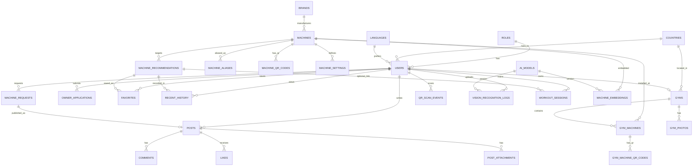

# MachineFit ERD



## Core Identity Chain

```
brandCode (HAMMER_STRENGTH)
    └── machineCode (HS_ISO_LATERAL_HIGH_ROW)  ← canonical API identifier
            ├── machine_settings (recommendation rules)
            ├── machine_qr_codes (QR → deep link)
            ├── machine_embeddings (AI search)
            └── gym_machines (per-gym inventory)
                    └── gym_machine_qr_codes (gym-specific QR)
```

## Gym Owner Chain

```
member → owner_applications (pending)
              ↓ admin approves
         users.role = owner
              ↓
         gyms (registration_status: draft → pending → approved)
              ↓
         gym_machines (inventory by machine_id)
```
